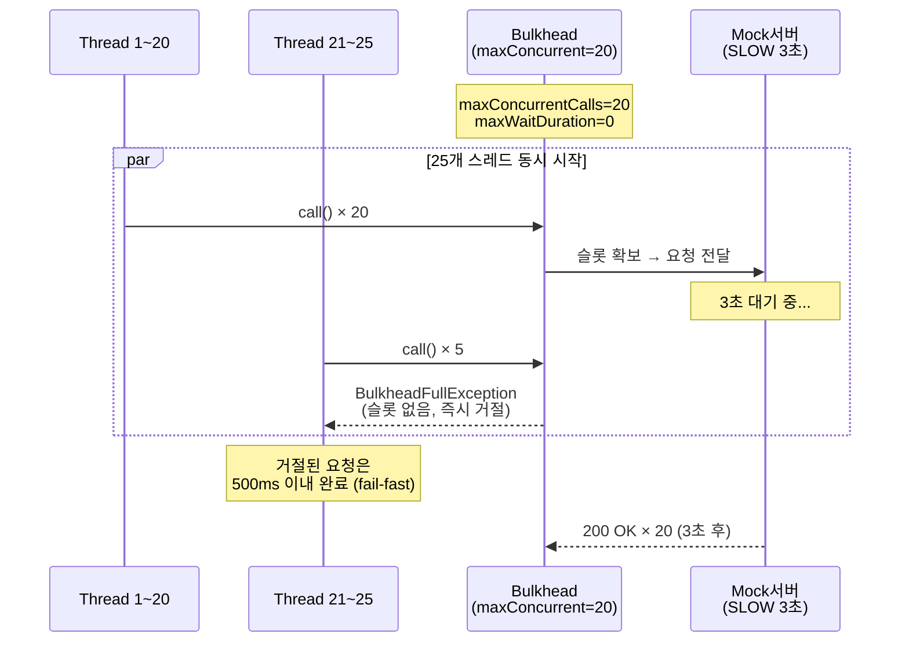
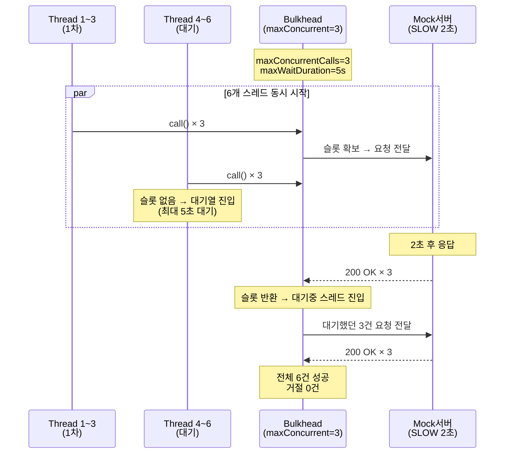
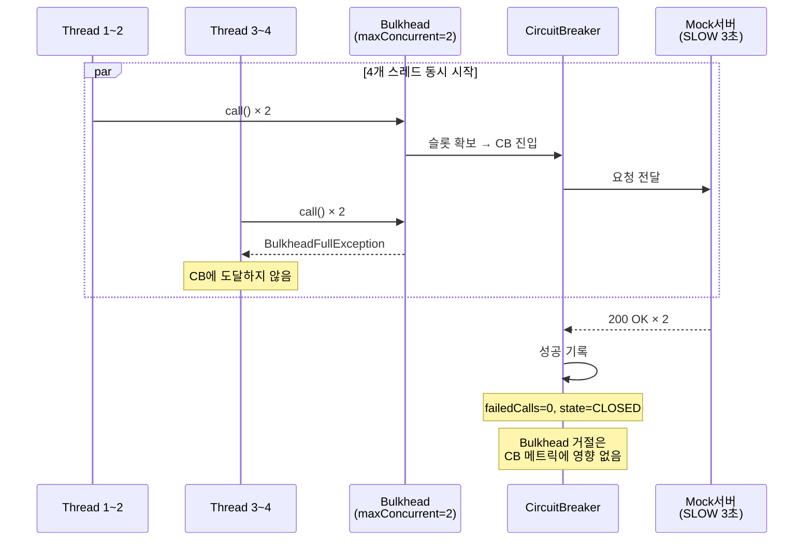
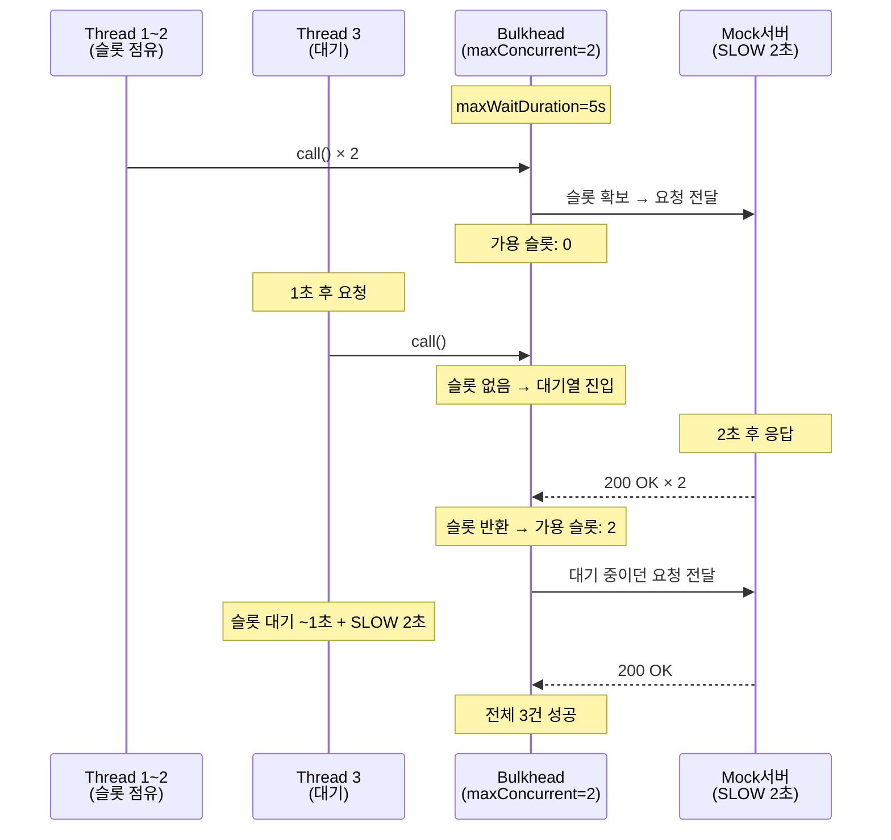
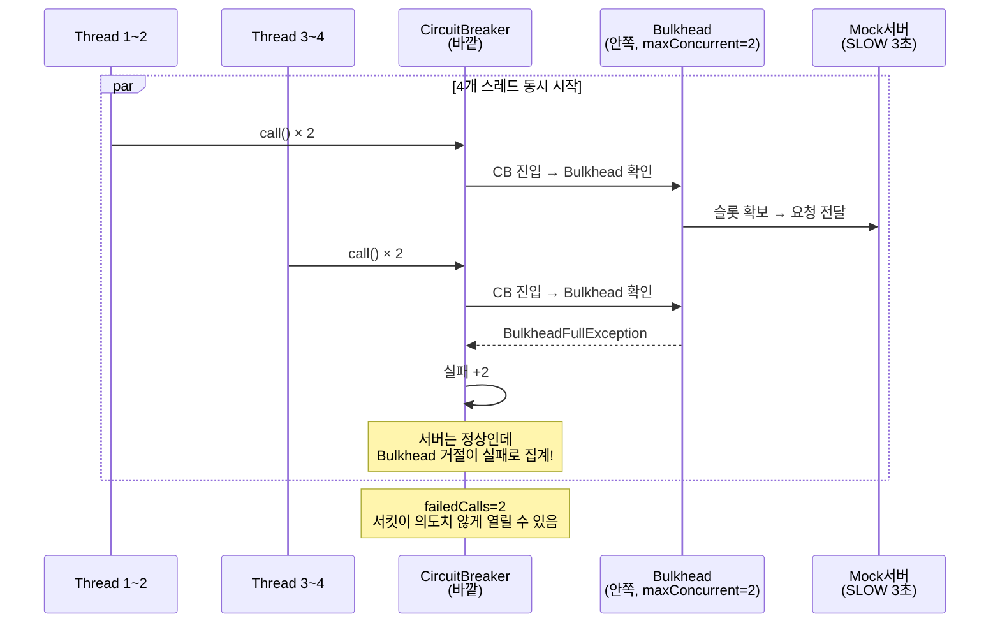
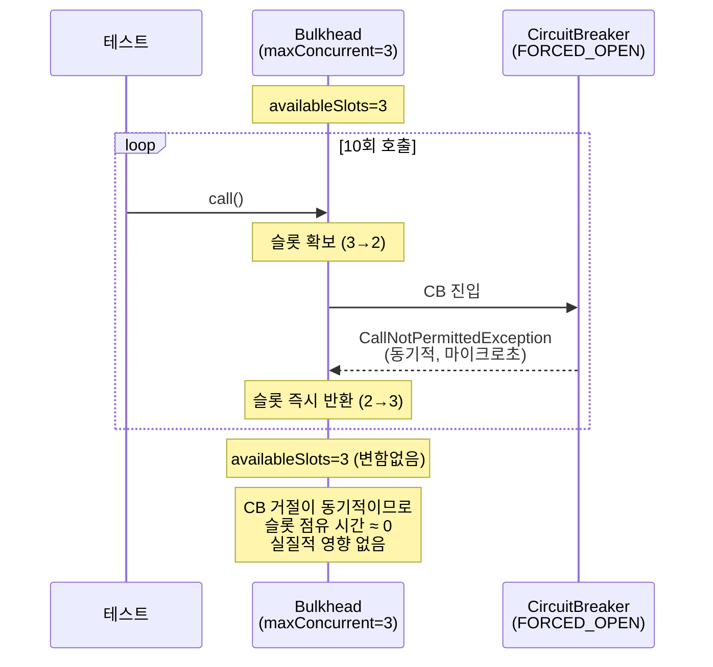
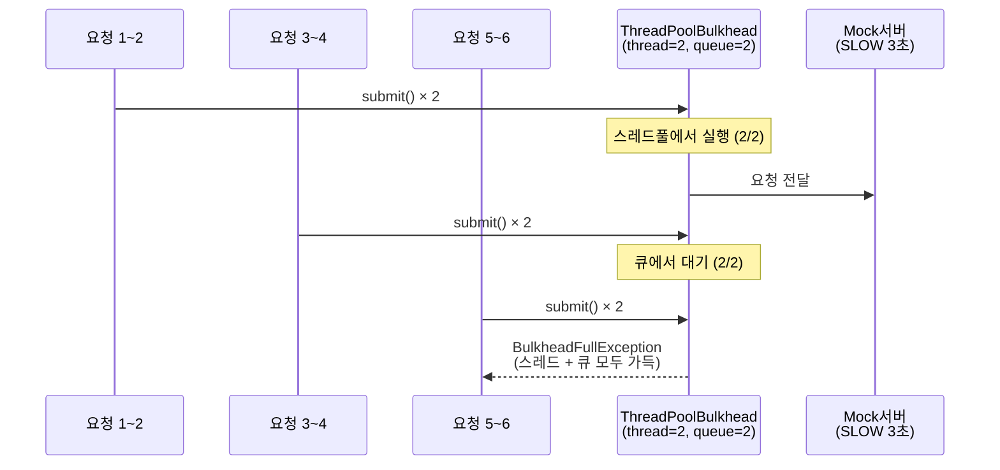
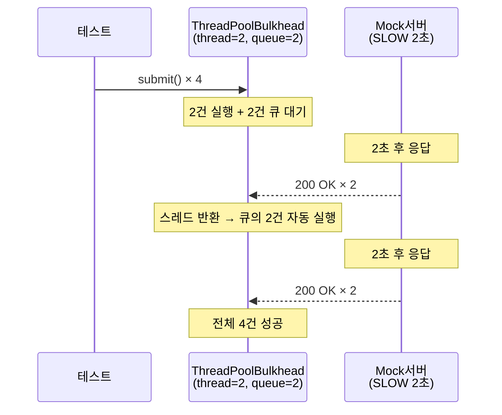

# Bulkhead 학습 테스트

동시 호출 제한과 장애 격리. Bulkhead는 동시 요청 수를 물리적으로 제한하여
하나의 장애가 전체 시스템으로 번지는 것을 막는다.

---

## BulkheadBasicTest

### 동시 25건 중 20건 통과, 5건 즉시 거절



### maxWaitDuration > 0 → 대기 후 통과



### Bulkhead(바깥) + CB(안쪽) → 거절이 CB 실패로 집계 안 됨



### 슬롯 반환 → 대기 중이던 요청 통과



### CB(바깥) → Bulkhead(안쪽) — 잘못된 순서



### CB OPEN 시 Bulkhead 슬롯 소비 → 즉시 반환



---

## ThreadPoolBulkheadTest

SemaphoreBulkhead와 다른 실행 모델 — 별도 스레드풀 + 큐.

### SemaphoreBulkhead vs ThreadPoolBulkhead

| 항목 | SemaphoreBulkhead | ThreadPoolBulkhead |
|------|-------------------|---------------------|
| 실행 스레드 | 호출자 스레드 그대로 | 전용 스레드풀 |
| 제한 방식 | maxConcurrentCalls | maxThreadPoolSize + queueCapacity |
| 반환 타입 | T (동기) | CompletionStage\<T\> (비동기) |
| ThreadLocal | 유지됨 | 유실됨 (contextPropagator 필요) |

### maxThreadPoolSize + queueCapacity 초과 → 거절



### 큐 대기 → 스레드 반환 → 자동 실행



### ThreadPoolBulkhead(바깥) + CB(안쪽)

| 설정 | 동시 요청 | 통과 | 거절 | CB 실패 |
|------|----------|------|------|---------|
| thread=2, queue=0 | 4건 | 2건 | 2건 | 0건 |

거절은 CB 도달 전에 발생 → CB 메트릭 영향 없음.

---

### 핵심 원칙

```
Bulkhead(바깥) → CircuitBreaker(안쪽) → 서버
     ↑ 동시성 제한이 먼저
     ↑ 거절된 요청은 CB에 도달하지 않음
     ↑ CB 실패율이 오염되지 않음
     ↑ CB OPEN 시 슬롯은 잡았다가 즉시 반환 (무해)

CB(바깥) → Bulkhead(안쪽) → 서버  ← 잘못된 순서!
     ↑ BulkheadFullException이 CB 실패로 집계
     ↑ 서버 정상인데 서킷 열림 (오작동)
```
