# CircuitBreaker 학습 테스트

서킷브레이커의 상태 전이, slowCall 감지, HALF-OPEN 동작,
예외 처리 전략, 설정 함정, 그리고 TestLogger 이벤트 타이밍 문제.

---

## CircuitBreakerBasicTest

CLOSED → OPEN 전이의 기본 메커니즘.

### 100% 실패 → OPEN 전환

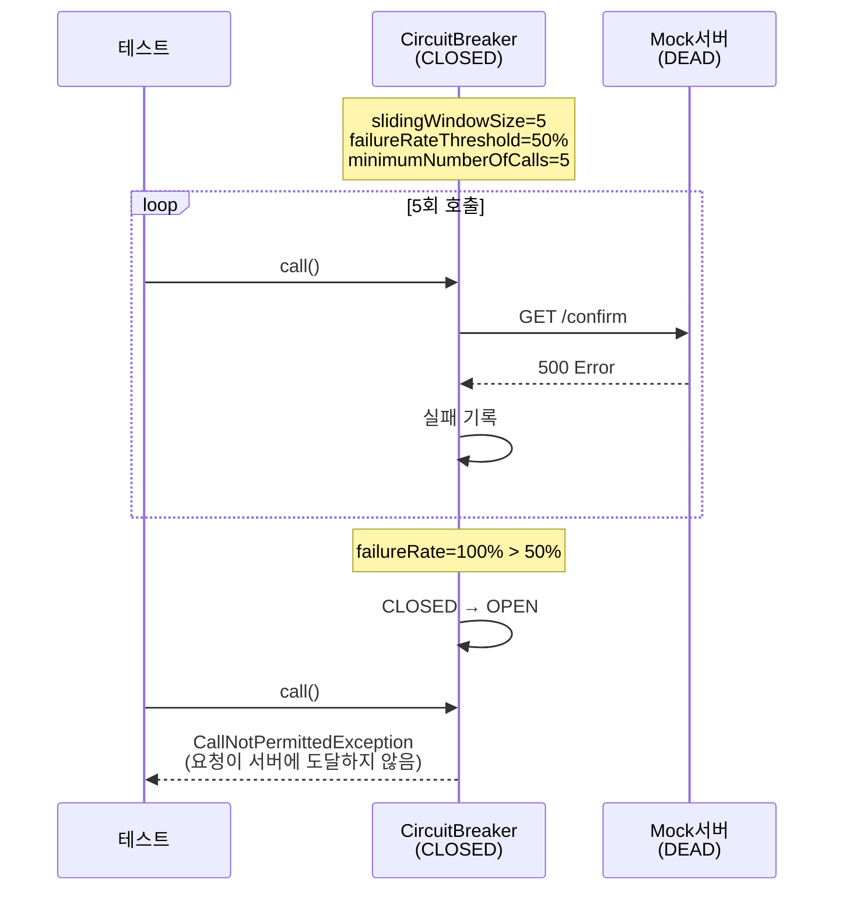
```mermaid
sequenceDiagram
    participant Test as 테스트
    participant CB as CircuitBreaker<br/>(CLOSED)
    participant Mock as Mock서버<br/>(DEAD)

    Note over CB: slidingWindowSize=5<br/>failureRateThreshold=50%<br/>minimumNumberOfCalls=5

    loop 5회 호출
        Test->>CB: call()
        CB->>Mock: GET /confirm
        Mock-->>CB: 500 Error
        CB->>CB: 실패 기록
    end

    Note over CB: failureRate=100% > 50%
    CB->>CB: CLOSED → OPEN

    Test->>CB: call()
    CB-->>Test: CallNotPermittedException<br/>(요청이 서버에 도달하지 않음)
```

### 경계값: 실패율이 threshold 미만이면 CLOSED 유지

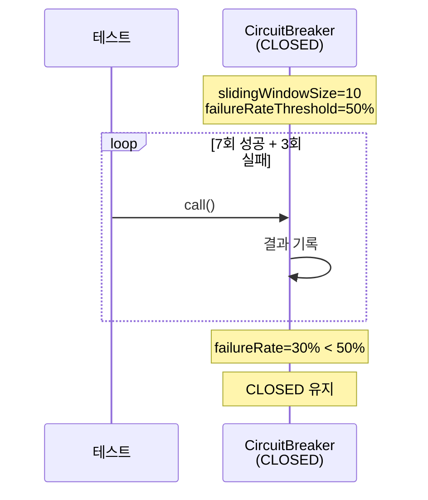
```mermaid
sequenceDiagram
    participant Test as 테스트
    participant CB as CircuitBreaker<br/>(CLOSED)

    Note over CB: slidingWindowSize=10<br/>failureRateThreshold=50%

    loop 7회 성공 + 3회 실패
        Test->>CB: call()
        CB->>CB: 결과 기록
    end

    Note over CB: failureRate=30% < 50%
    Note over CB: CLOSED 유지
```

---

## CircuitBreakerRecoveryTest

OPEN → HALF_OPEN → CLOSED/OPEN 복구 흐름.

### 복구 성공

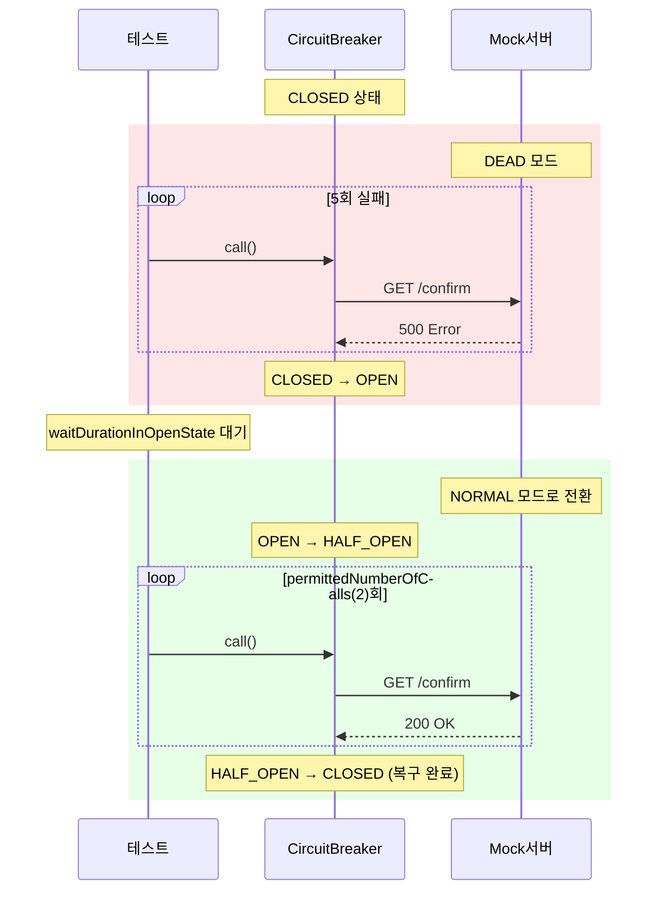
```mermaid
sequenceDiagram
    participant Test as 테스트
    participant CB as CircuitBreaker
    participant Mock as Mock서버

    Note over CB: CLOSED 상태

    rect rgb(255, 230, 230)
        Note over Mock: DEAD 모드
        loop 5회 실패
            Test->>CB: call()
            CB->>Mock: GET /confirm
            Mock-->>CB: 500 Error
        end
        Note over CB: CLOSED → OPEN
    end

    Note over Test: waitDurationInOpenState 대기

    rect rgb(230, 255, 230)
        Note over Mock: NORMAL 모드로 전환
        Note over CB: OPEN → HALF_OPEN
        loop permittedNumberOfCalls(2)회
            Test->>CB: call()
            CB->>Mock: GET /confirm
            Mock-->>CB: 200 OK
        end
        Note over CB: HALF_OPEN → CLOSED (복구 완료)
    end
```

### 복구 실패 → 다시 OPEN

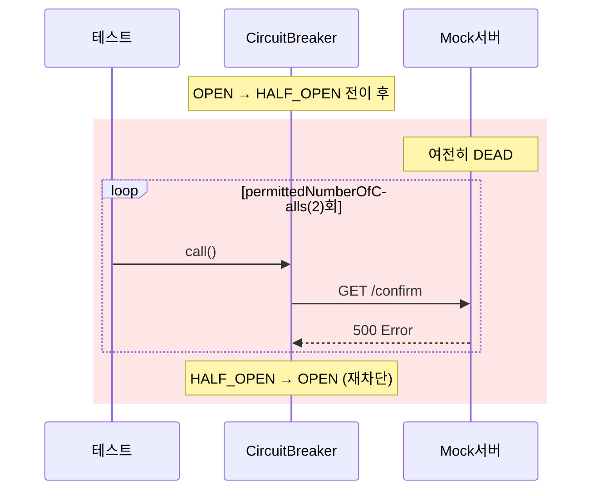
```mermaid
sequenceDiagram
    participant Test as 테스트
    participant CB as CircuitBreaker
    participant Mock as Mock서버

    Note over CB: OPEN → HALF_OPEN 전이 후

    rect rgb(255, 230, 230)
        Note over Mock: 여전히 DEAD
        loop permittedNumberOfCalls(2)회
            Test->>CB: call()
            CB->>Mock: GET /confirm
            Mock-->>CB: 500 Error
        end
        Note over CB: HALF_OPEN → OPEN (재차단)
    end
```

---

## SlowCallDetectionTest

slowCall은 timeout과 다르다 — 요청을 끊지 않고, 느린 성공도 장애 전조로 집계한다.

### slowCall vs timeout

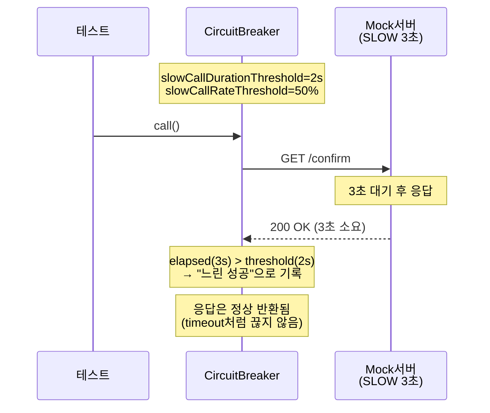
```mermaid
sequenceDiagram
    participant Test as 테스트
    participant CB as CircuitBreaker
    participant Mock as Mock서버<br/>(SLOW 3초)

    Note over CB: slowCallDurationThreshold=2s<br/>slowCallRateThreshold=50%

    Test->>CB: call()
    CB->>Mock: GET /confirm
    Note over Mock: 3초 대기 후 응답
    Mock-->>CB: 200 OK (3초 소요)

    Note over CB: elapsed(3s) > threshold(2s)<br/>→ "느린 성공"으로 기록
    Note over CB: 응답은 정상 반환됨<br/>(timeout처럼 끊지 않음)
```

### slowCall + failure 복합

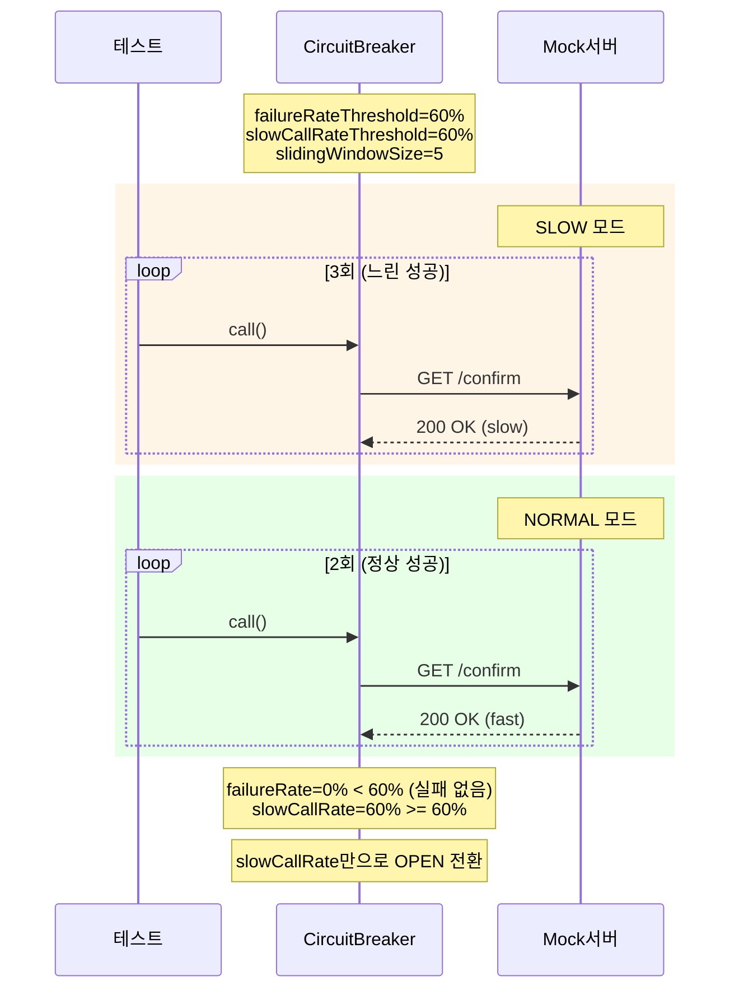
```mermaid
sequenceDiagram
    participant Test as 테스트
    participant CB as CircuitBreaker
    participant Mock as Mock서버

    Note over CB: failureRateThreshold=60%<br/>slowCallRateThreshold=60%<br/>slidingWindowSize=5

    rect rgb(255, 245, 230)
        Note over Mock: SLOW 모드
        loop 3회 (느린 성공)
            Test->>CB: call()
            CB->>Mock: GET /confirm
            Mock-->>CB: 200 OK (slow)
        end
    end

    rect rgb(230, 255, 230)
        Note over Mock: NORMAL 모드
        loop 2회 (정상 성공)
            Test->>CB: call()
            CB->>Mock: GET /confirm
            Mock-->>CB: 200 OK (fast)
        end
    end

    Note over CB: failureRate=0% < 60% (실패 없음)<br/>slowCallRate=60% >= 60%
    Note over CB: slowCallRate만으로 OPEN 전환
```

---

## HalfOpenBehaviorTest

HALF_OPEN 상태의 제약 조건과 함정.

### permittedCalls 초과 → 거절

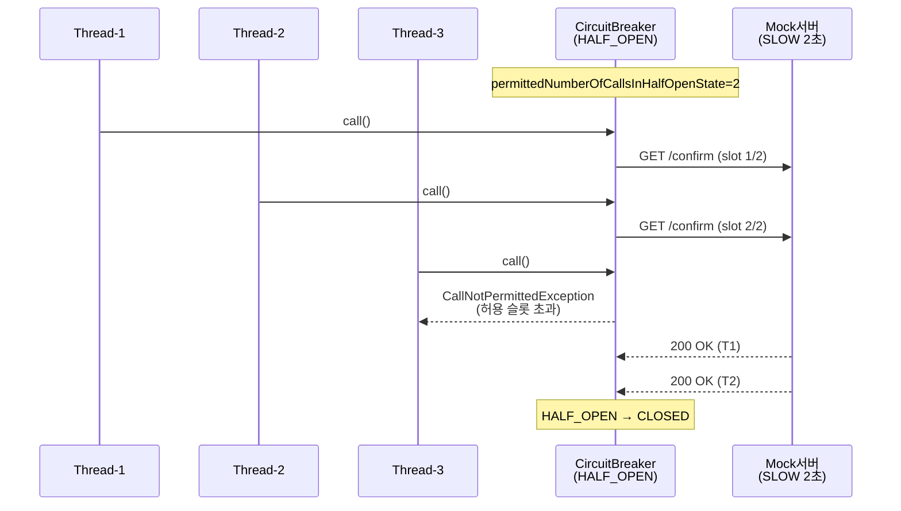
```mermaid
sequenceDiagram
    participant T1 as Thread-1
    participant T2 as Thread-2
    participant T3 as Thread-3
    participant CB as CircuitBreaker<br/>(HALF_OPEN)
    participant Mock as Mock서버<br/>(SLOW 2초)

    Note over CB: permittedNumberOfCallsInHalfOpenState=2

    T1->>CB: call()
    CB->>Mock: GET /confirm (slot 1/2)
    T2->>CB: call()
    CB->>Mock: GET /confirm (slot 2/2)

    T3->>CB: call()
    CB-->>T3: CallNotPermittedException<br/>(허용 슬롯 초과)

    Mock-->>CB: 200 OK (T1)
    Mock-->>CB: 200 OK (T2)
    Note over CB: HALF_OPEN → CLOSED
```

### maxWaitDurationInHalfOpenState=0 → 무한 대기

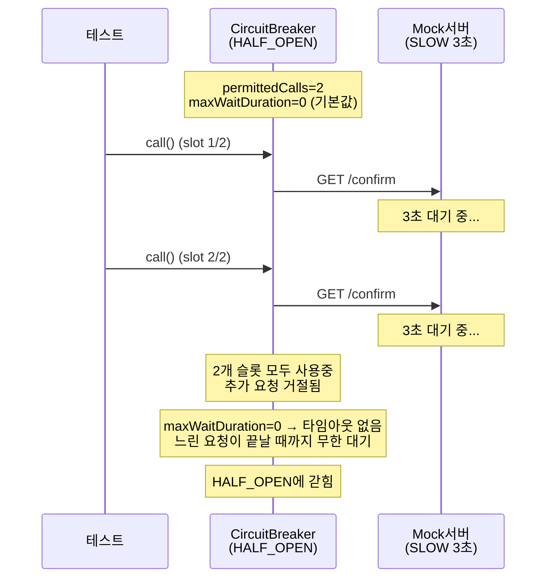
```mermaid
sequenceDiagram
    participant Test as 테스트
    participant CB as CircuitBreaker<br/>(HALF_OPEN)
    participant Mock as Mock서버<br/>(SLOW 3초)

    Note over CB: permittedCalls=2<br/>maxWaitDuration=0 (기본값)

    Test->>CB: call() (slot 1/2)
    CB->>Mock: GET /confirm
    Note over Mock: 3초 대기 중...

    Test->>CB: call() (slot 2/2)
    CB->>Mock: GET /confirm
    Note over Mock: 3초 대기 중...

    Note over CB: 2개 슬롯 모두 사용중<br/>추가 요청 거절됨
    Note over CB: maxWaitDuration=0 → 타임아웃 없음<br/>느린 요청이 끝날 때까지 무한 대기
    Note over CB: HALF_OPEN에 갇힘
```

---

## ExceptionHandlingTest

어떤 예외를 실패로 집계할 것인가 — 비즈니스 예외 오진 방지.

### 기본 동작: 모든 예외 = 실패 (오진)

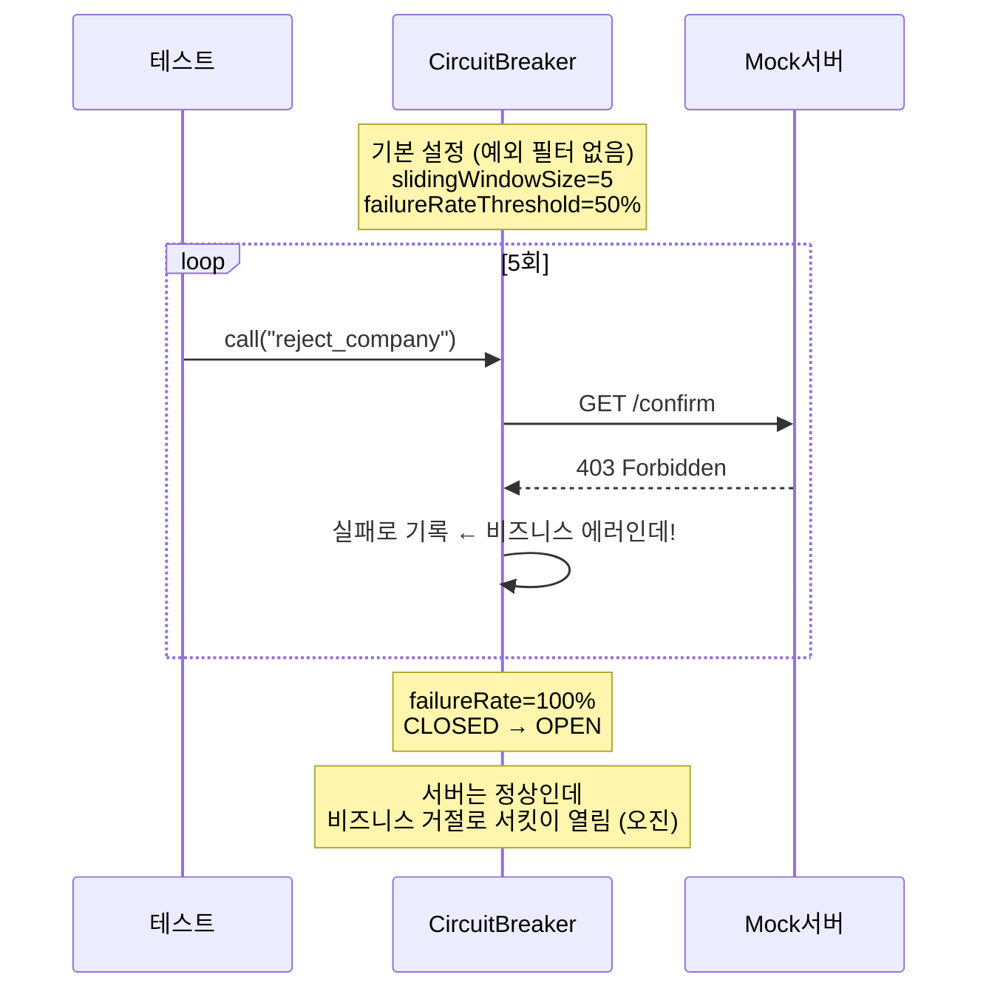
```mermaid
sequenceDiagram
    participant Test as 테스트
    participant CB as CircuitBreaker
    participant Mock as Mock서버

    Note over CB: 기본 설정 (예외 필터 없음)<br/>slidingWindowSize=5<br/>failureRateThreshold=50%

    loop 5회
        Test->>CB: call("reject_company")
        CB->>Mock: GET /confirm
        Mock-->>CB: 403 Forbidden
        CB->>CB: 실패로 기록 ← 비즈니스 에러인데!
    end

    Note over CB: failureRate=100%<br/>CLOSED → OPEN
    Note over CB: 서버는 정상인데<br/>비즈니스 거절로 서킷이 열림 (오진)
```

### ignoreExceptions로 해결

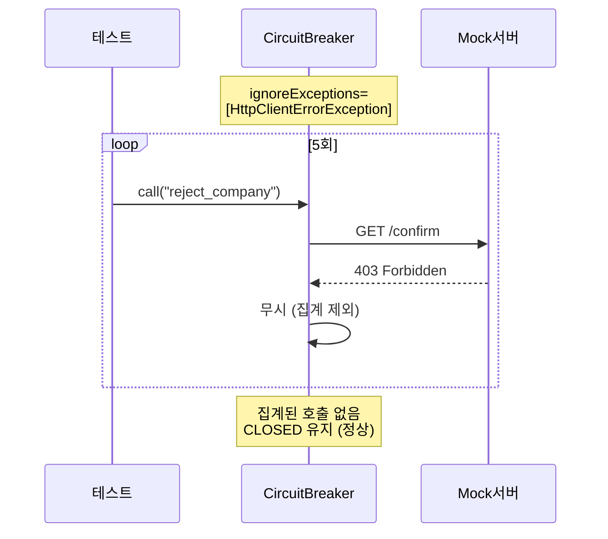
```mermaid
sequenceDiagram
    participant Test as 테스트
    participant CB as CircuitBreaker
    participant Mock as Mock서버

    Note over CB: ignoreExceptions=<br/>[HttpClientErrorException]

    loop 5회
        Test->>CB: call("reject_company")
        CB->>Mock: GET /confirm
        Mock-->>CB: 403 Forbidden
        CB->>CB: 무시 (집계 제외)
    end

    Note over CB: 집계된 호출 없음<br/>CLOSED 유지 (정상)
```

### 우선순위: ignoreExceptions > recordExceptions

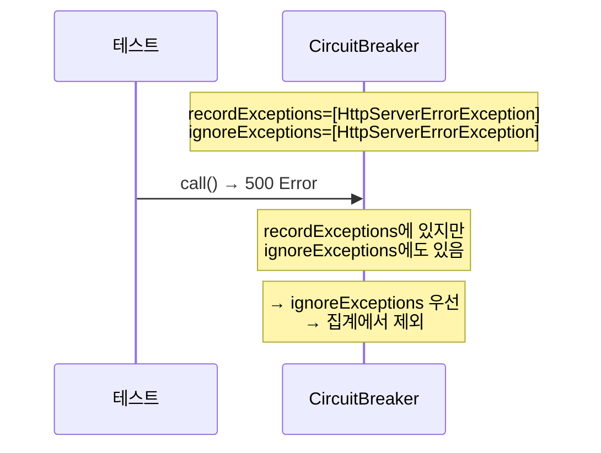
```mermaid
sequenceDiagram
    participant Test as 테스트
    participant CB as CircuitBreaker

    Note over CB: recordExceptions=[HttpServerErrorException]<br/>ignoreExceptions=[HttpServerErrorException]

    Test->>CB: call() → 500 Error

    Note over CB: recordExceptions에 있지만<br/>ignoreExceptions에도 있음
    Note over CB: → ignoreExceptions 우선<br/>→ 집계에서 제외
```

---

## CircuitBreakerTrapTest — 설정 함정 6가지

각 함정마다 "잘못된 설정 → 올바른 설정" Before/After 증명.

### 함정 1: minimumNumberOfCalls 기본값 100

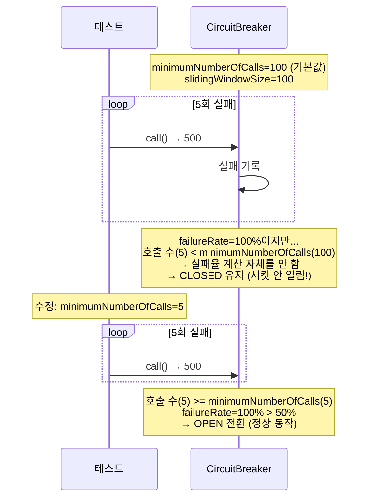
```mermaid
sequenceDiagram
    participant Test as 테스트
    participant CB as CircuitBreaker

    Note over CB: minimumNumberOfCalls=100 (기본값)<br/>slidingWindowSize=100

    loop 5회 실패
        Test->>CB: call() → 500
        CB->>CB: 실패 기록
    end

    Note over CB: failureRate=100%이지만...<br/>호출 수(5) < minimumNumberOfCalls(100)<br/>→ 실패율 계산 자체를 안 함<br/>→ CLOSED 유지 (서킷 안 열림!)

    Note over Test: 수정: minimumNumberOfCalls=5

    loop 5회 실패
        Test->>CB: call() → 500
    end

    Note over CB: 호출 수(5) >= minimumNumberOfCalls(5)<br/>failureRate=100% > 50%<br/>→ OPEN 전환 (정상 동작)
```

### 함정 2: automaticTransition=false (기본값)

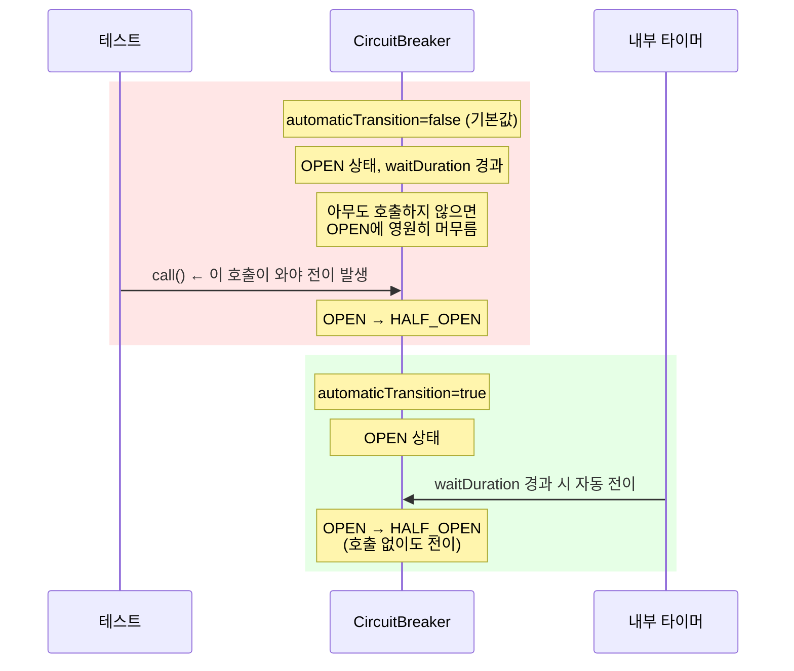
```mermaid
sequenceDiagram
    participant Test as 테스트
    participant CB as CircuitBreaker
    participant Timer as 내부 타이머

    rect rgb(255, 230, 230)
        Note over CB: automaticTransition=false (기본값)
        Note over CB: OPEN 상태, waitDuration 경과
        Note over CB: 아무도 호출하지 않으면<br/>OPEN에 영원히 머무름
        Test->>CB: call() ← 이 호출이 와야 전이 발생
        Note over CB: OPEN → HALF_OPEN
    end

    rect rgb(230, 255, 230)
        Note over CB: automaticTransition=true
        Note over CB: OPEN 상태
        Timer->>CB: waitDuration 경과 시 자동 전이
        Note over CB: OPEN → HALF_OPEN<br/>(호출 없이도 전이)
    end
```

### 함정 3: ignoreExceptions 미설정

(ExceptionHandlingTest 섹션 참고)

### 함정 4: slidingWindowSize 기본값 100

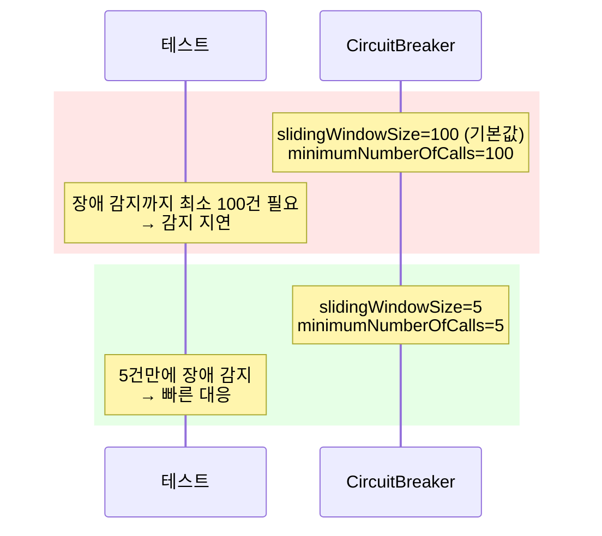
```mermaid
sequenceDiagram
    participant Test as 테스트
    participant CB as CircuitBreaker

    rect rgb(255, 230, 230)
        Note over CB: slidingWindowSize=100 (기본값)<br/>minimumNumberOfCalls=100
        Note over Test: 장애 감지까지 최소 100건 필요<br/>→ 감지 지연
    end

    rect rgb(230, 255, 230)
        Note over CB: slidingWindowSize=5<br/>minimumNumberOfCalls=5
        Note over Test: 5건만에 장애 감지<br/>→ 빠른 대응
    end
```

### 함정 5: slowCallDurationThreshold와 readTimeout 관계

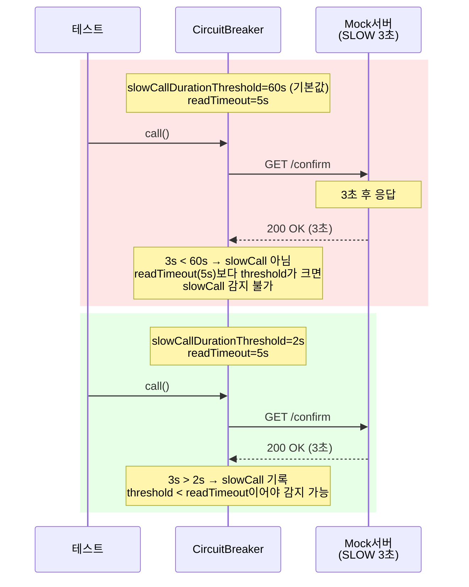
```mermaid
sequenceDiagram
    participant Test as 테스트
    participant CB as CircuitBreaker
    participant Mock as Mock서버<br/>(SLOW 3초)

    rect rgb(255, 230, 230)
        Note over CB: slowCallDurationThreshold=60s (기본값)<br/>readTimeout=5s
        Test->>CB: call()
        CB->>Mock: GET /confirm
        Note over Mock: 3초 후 응답
        Mock-->>CB: 200 OK (3초)
        Note over CB: 3s < 60s → slowCall 아님<br/>readTimeout(5s)보다 threshold가 크면<br/>slowCall 감지 불가
    end

    rect rgb(230, 255, 230)
        Note over CB: slowCallDurationThreshold=2s<br/>readTimeout=5s
        Test->>CB: call()
        CB->>Mock: GET /confirm
        Mock-->>CB: 200 OK (3초)
        Note over CB: 3s > 2s → slowCall 기록<br/>threshold < readTimeout이어야 감지 가능
    end
```

### 함정 6: maxWaitDurationInHalfOpenState=0

(HalfOpenBehaviorTest 섹션 참고)

---

## TestLogger 이벤트 타이밍 문제

CircuitBreaker의 이벤트 콜백에서 `cb.getMetrics()` 조회 시
현재 호출이 미반영되는 문제와 해결.

### 원인: Resilience4j 내부 실행 순서

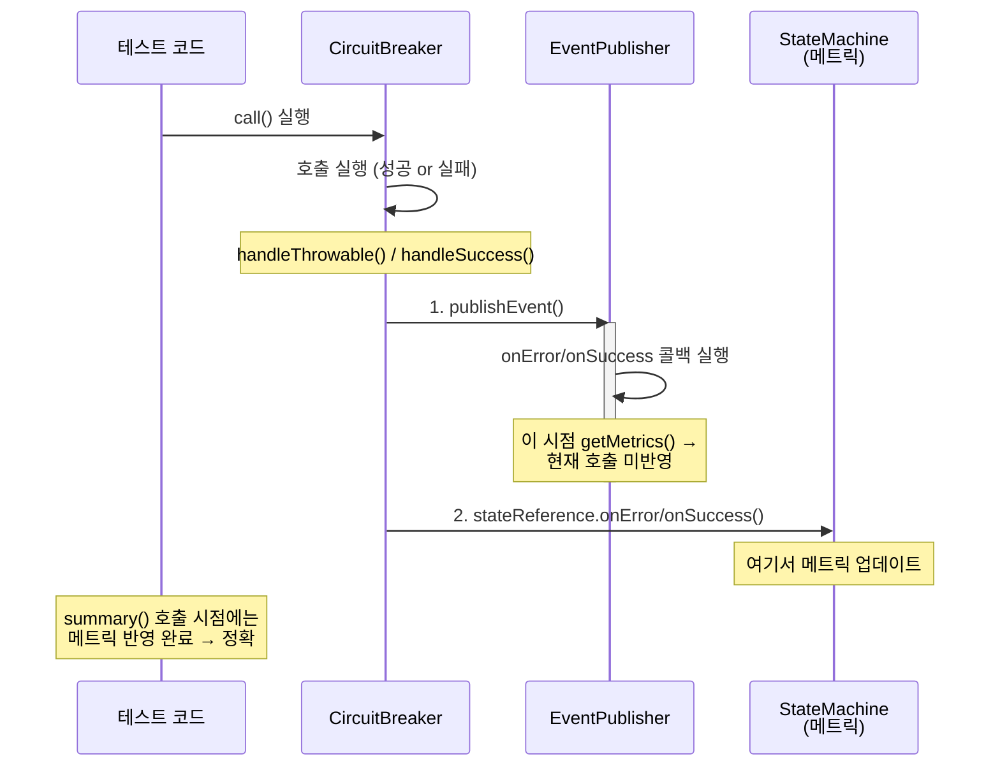
```mermaid
sequenceDiagram
    participant Client as 테스트 코드
    participant CB as CircuitBreaker
    participant EP as EventPublisher
    participant State as StateMachine<br/>(메트릭)

    Client->>CB: call() 실행
    CB->>CB: 호출 실행 (성공 or 실패)

    Note over CB: handleThrowable() / handleSuccess()

    CB->>EP: 1. publishEvent()
    activate EP
    EP->>EP: onError/onSuccess 콜백 실행
    Note over EP: 이 시점 getMetrics() →<br/>현재 호출 미반영
    deactivate EP

    CB->>State: 2. stateReference.onError/onSuccess()
    Note over State: 여기서 메트릭 업데이트

    Note over Client: summary() 호출 시점에는<br/>메트릭 반영 완료 → 정확
```

### 해결: AtomicInteger 자체 카운터

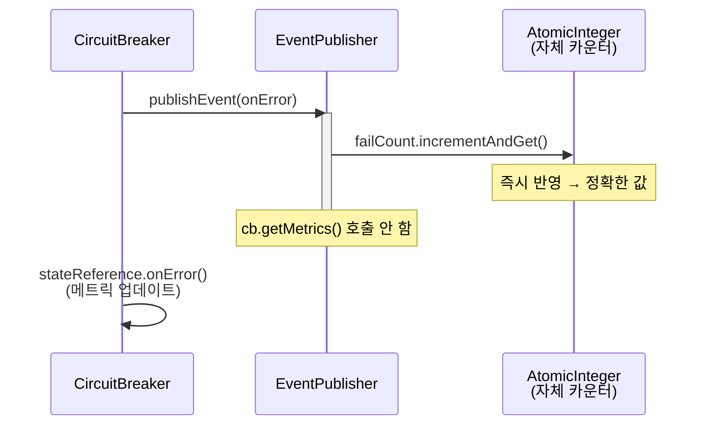
```mermaid
sequenceDiagram
    participant CB as CircuitBreaker
    participant EP as EventPublisher
    participant Counter as AtomicInteger<br/>(자체 카운터)

    CB->>EP: publishEvent(onError)
    activate EP
    EP->>Counter: failCount.incrementAndGet()
    Note over Counter: 즉시 반영 → 정확한 값
    Note over EP: cb.getMetrics() 호출 안 함
    deactivate EP

    CB->>CB: stateReference.onError()<br/>(메트릭 업데이트)
```
