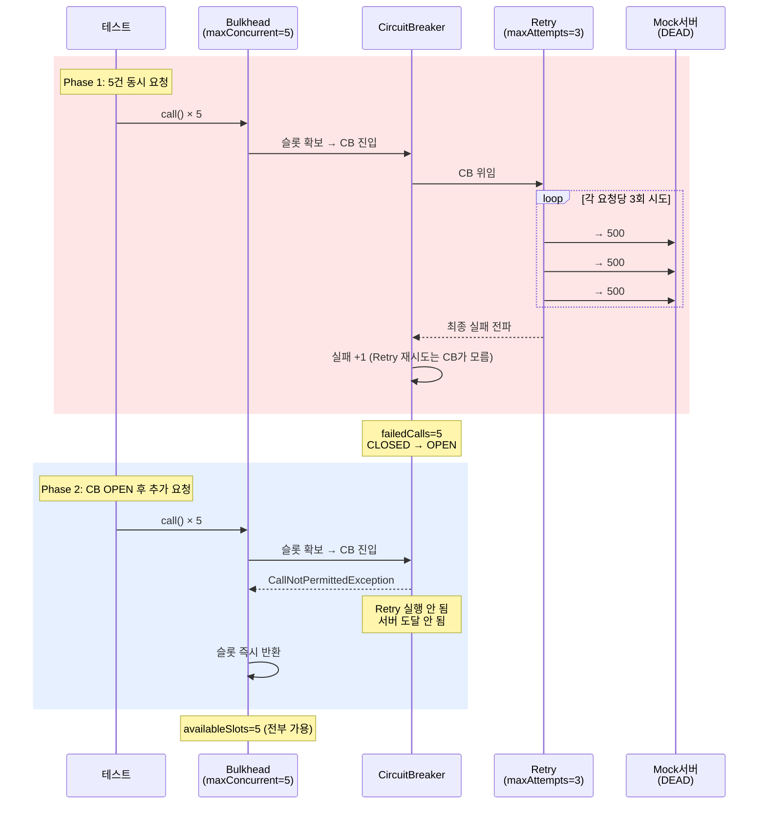
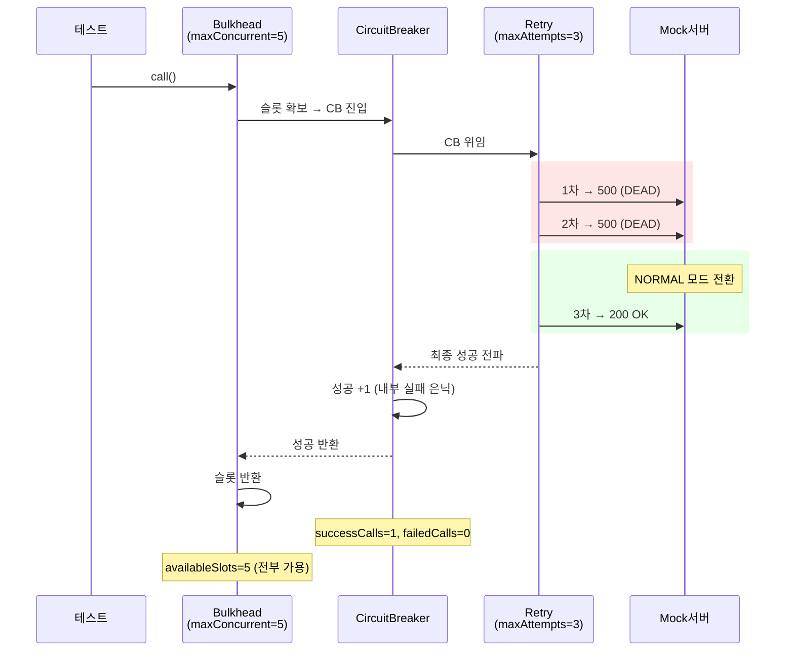
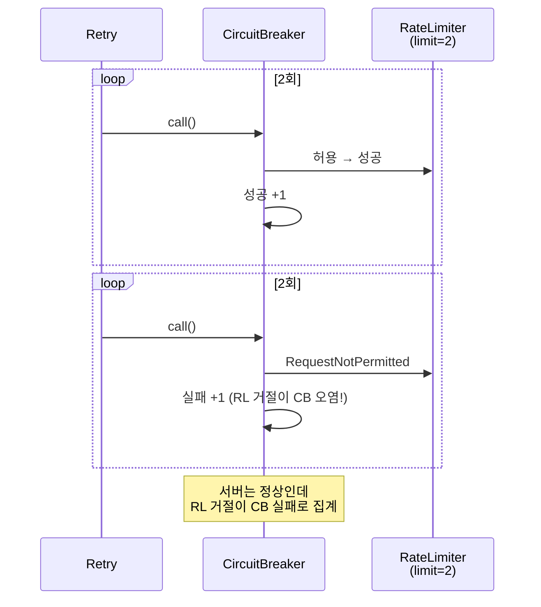
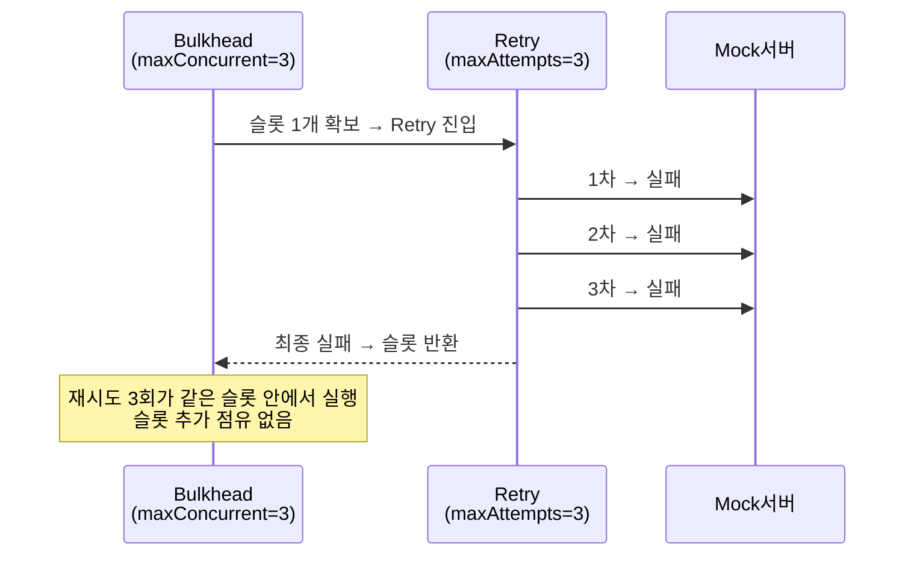
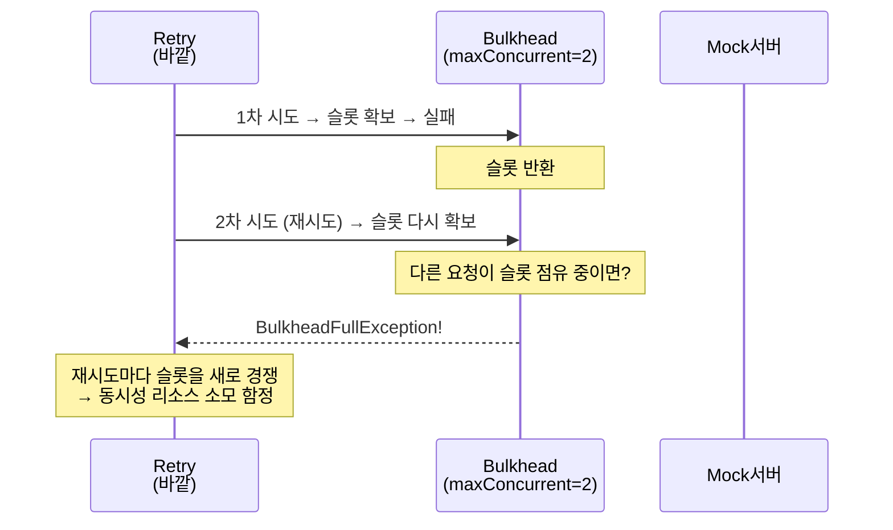

# 조합 학습 테스트

3단~5단 조합의 실제 동작과 순서 함정.
개별 2단 조합이 아닌 프로덕션 전체 체인을 검증한다.

---

## FullChainTest

### 3단 조합: 전부 실패 → CB OPEN → 후속 요청 즉시 거절



### 3단 조합: Retry 성공 → CB 성공 + Bulkhead 정상



### 공식 권장 데코레이터 순서

```
Bulkhead(바깥) → CircuitBreaker → Retry(안쪽) → 서버

각 레이어의 역할:
  Bulkhead  : 동시성 제한 — 슬롯 초과 시 즉시 거절
  CB        : 장애 감지 — 실패율 기반 차단
  Retry     : 일시적 장애 복구 — 재시도로 흡수

핵심:
  - Retry 재시도는 CB에 1건으로 집계 (실패율 오염 방지)
  - CB OPEN 시 Retry도 실행 안 됨 (서버 보호)
  - Bulkhead 거절은 CB에 도달하지 않음 (메트릭 오염 방지)
```

---

## FiveLayerChainTest

Resilience4j Spring Boot 기본 Aspect 순서와 동일한 5단 풀체인.

### 데코레이터 순서 (바깥 → 안쪽)

```
Retry → CircuitBreaker → RateLimiter → TimeLimiter → Bulkhead → 서버
```

### 5단 풀체인: 정상 통과

| 레이어 | 설정 | 역할 |
|--------|------|------|
| Retry | maxAttempts=3 | 최종 실패 시 전체 재시도 |
| CB | failureRate=50% | 실패율 기반 차단 |
| RateLimiter | limit=10/10s | 초당 호출 수 제한 |
| TimeLimiter | timeout=5s | 개별 호출 타임아웃 |
| Bulkhead | maxConcurrent=5 | 동시 실행 수 제한 |

### 기본 Aspect 순서의 함정: RL이 CB 안쪽



### 장애 시 Retry + CB 연동

| Phase | 상태 | 동작 |
|-------|------|------|
| 1 | DEAD → 5건 실패 | 각 Retry 3회 시도 → CB에 5건 집계 → OPEN |
| 2 | CB OPEN | 즉시 거절, 하위 레이어 도달 안 함 |

---

## RetryBulkheadSlotTest

Retry와 Bulkhead 순서에 따른 슬롯 소모 차이.

### 올바른 순서: Bulkhead(바깥) → Retry(안쪽)



### 잘못된 순서: Retry(바깥) → Bulkhead(안쪽)



### CB OPEN + CallNotPermittedException 재시도 여부

| retryExceptions 설정 | CB OPEN 시 동작 | 서버 호출 |
|---------------------|-----------------|----------|
| [5xx, timeout] (정상) | 즉시 실패 (재시도 없음) | 0회 |
| [5xx, timeout, **CallNotPermittedException**] (잘못) | 무의미한 재시도 3회 | 0회 (CB가 계속 차단) |

```
절대 CallNotPermittedException을 retryExceptions에 포함하면 안 된다.
CB가 의도적으로 차단한 요청을 Retry가 무력화한다.
```
