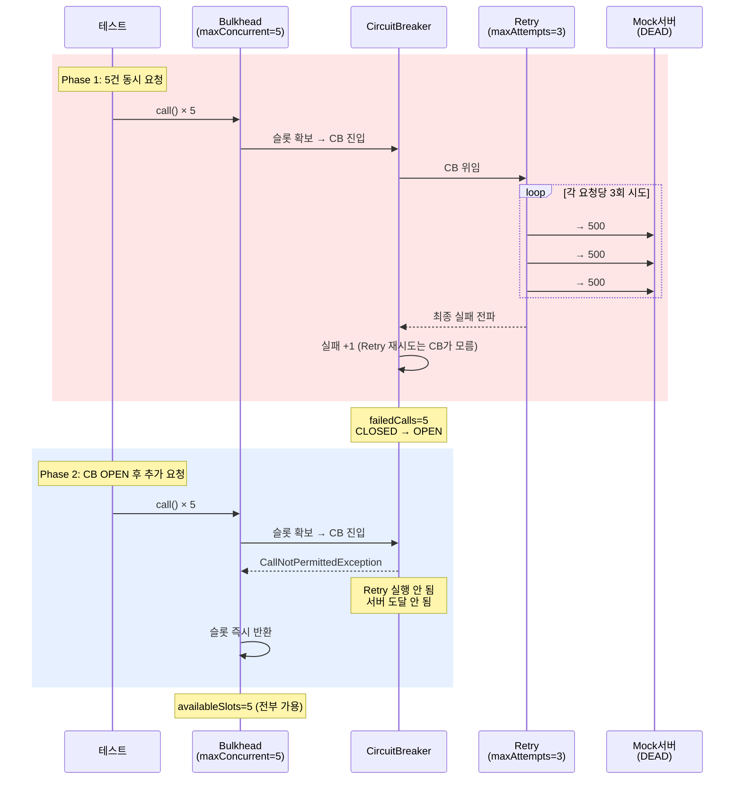
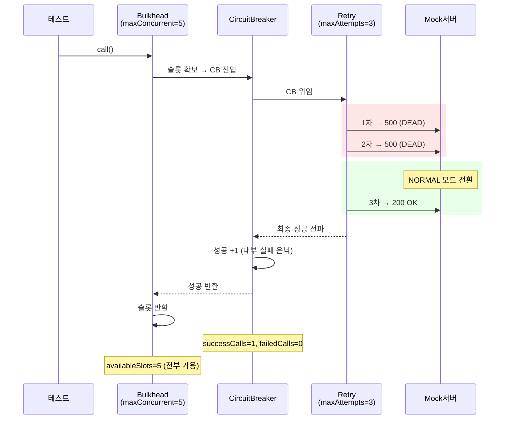

# 조합 학습 테스트

Bulkhead → CircuitBreaker → Retry 3단 조합의 실제 동작.
개별 2단 조합이 아닌 프로덕션 전체 체인을 검증한다.

---

## FullChainTest

### 3단 조합: 전부 실패 → CB OPEN → 후속 요청 즉시 거절



### 3단 조합: Retry 성공 → CB 성공 + Bulkhead 정상



### 공식 권장 데코레이터 순서

```
Bulkhead(바깥) → CircuitBreaker → Retry(안쪽) → 서버

각 레이어의 역할:
  Bulkhead  : 동시성 제한 — 슬롯 초과 시 즉시 거절
  CB        : 장애 감지 — 실패율 기반 차단
  Retry     : 일시적 장애 복구 — 재시도로 흡수

핵심:
  - Retry 재시도는 CB에 1건으로 집계 (실패율 오염 방지)
  - CB OPEN 시 Retry도 실행 안 됨 (서버 보호)
  - Bulkhead 거절은 CB에 도달하지 않음 (메트릭 오염 방지)
```
