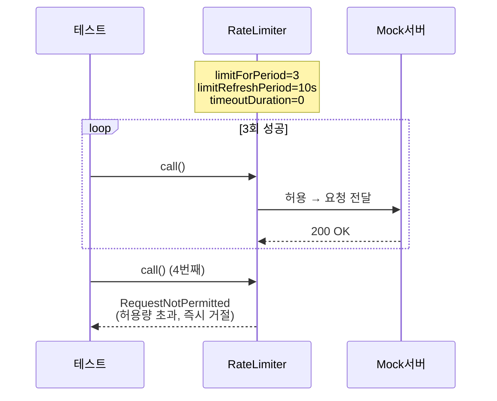
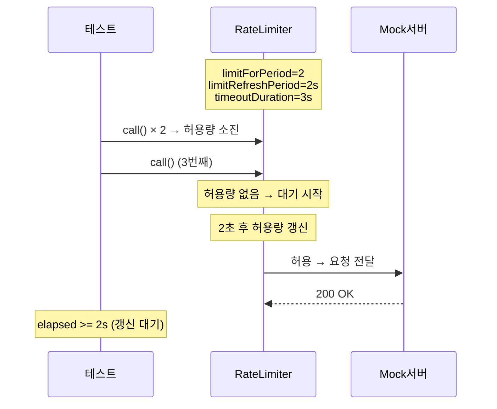
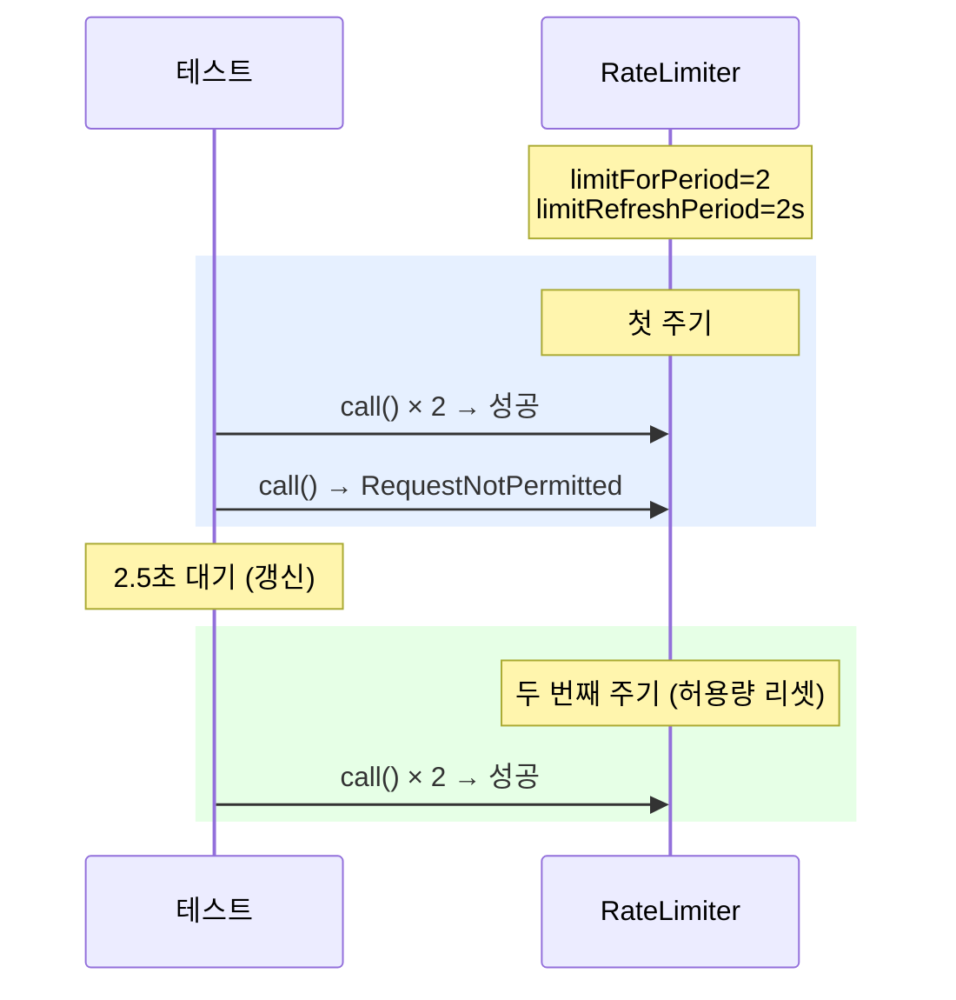
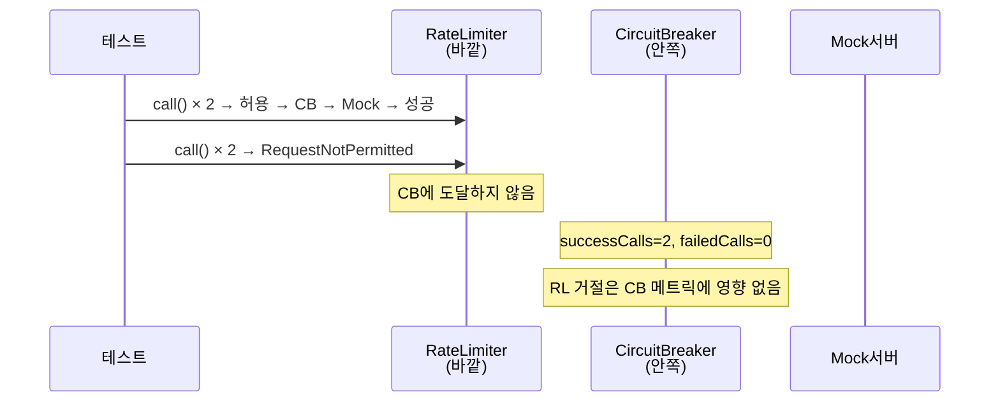
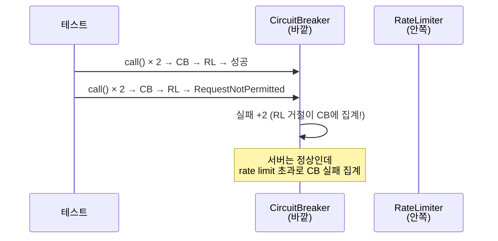

# RateLimiter 학습 테스트

일정 시간 동안 허용 가능한 호출 수를 제한하는 RateLimiter의 핵심 동작.

---

## RateLimiterBasicTest

### 기본 동작: limitForPeriod 초과 → RequestNotPermitted



### timeoutDuration > 0 → 허용량 갱신까지 대기



### limitRefreshPeriod 경과 후 허용량 갱신



### 동시 요청에서 정확히 limitForPeriod만 통과

| 설정 | 동시 요청 | 통과 | 거절 |
|------|----------|------|------|
| limitForPeriod=5 | 10건 | 5건 | 5건 |

### RateLimiter(바깥) + CB(안쪽) → 올바른 순서



### CB(바깥) → RateLimiter(안쪽) — 잘못된 순서



### 핵심 원칙

```
RateLimiter(바깥) → CircuitBreaker(안쪽) → 서버
     ↑ 호출 빈도 제한이 먼저
     ↑ 거절된 요청은 CB에 도달하지 않음
     ↑ CB 실패율이 오염되지 않음
```
