# Retry 학습 테스트

Resilience4j Retry의 핵심 동작, 예외 필터, 그리고 CircuitBreaker 조합 시 AOP 순서 함정.

---

## RetryBasicTest

### 첫 시도 실패 → 재시도 성공

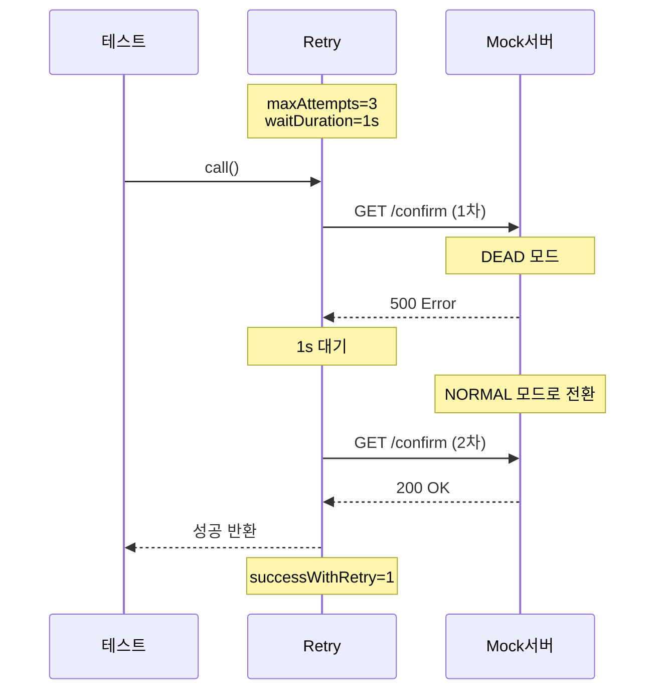
```mermaid
sequenceDiagram
    participant Test as 테스트
    participant Retry as Retry
    participant Mock as Mock서버

    Note over Retry: maxAttempts=3<br/>waitDuration=1s

    Test->>Retry: call()
    Retry->>Mock: GET /confirm (1차)
    Note over Mock: DEAD 모드
    Mock-->>Retry: 500 Error

    Note over Retry: 1s 대기

    Note over Mock: NORMAL 모드로 전환
    Retry->>Mock: GET /confirm (2차)
    Mock-->>Retry: 200 OK

    Retry-->>Test: 성공 반환
    Note over Retry: successWithRetry=1
```

### 전부 실패 → 최종 예외 전파

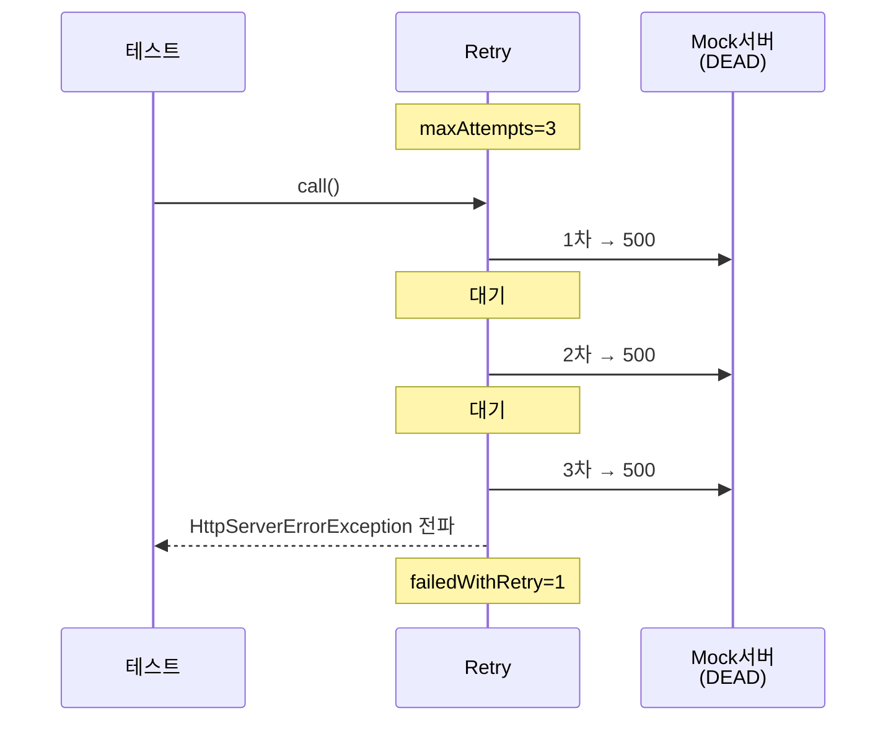
```mermaid
sequenceDiagram
    participant Test as 테스트
    participant Retry as Retry
    participant Mock as Mock서버<br/>(DEAD)

    Note over Retry: maxAttempts=3

    Test->>Retry: call()
    Retry->>Mock: 1차 → 500
    Note over Retry: 대기
    Retry->>Mock: 2차 → 500
    Note over Retry: 대기
    Retry->>Mock: 3차 → 500

    Retry-->>Test: HttpServerErrorException 전파
    Note over Retry: failedWithRetry=1
```

### waitDuration 대기 시간 검증

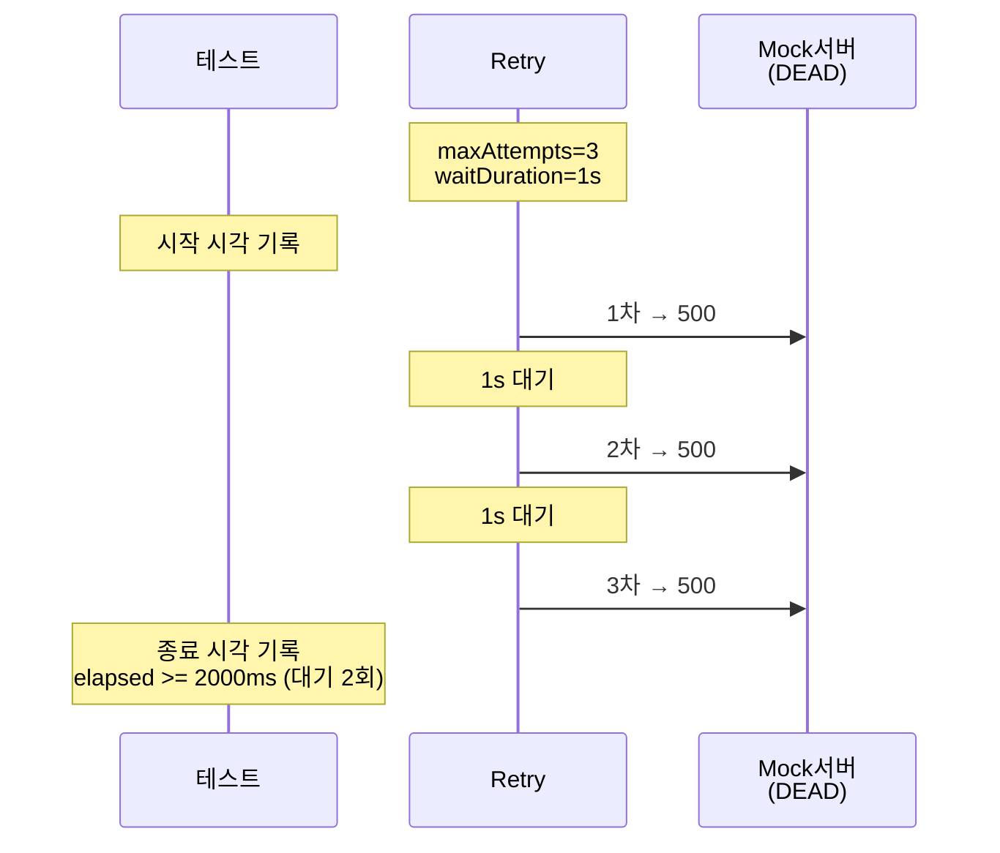
```mermaid
sequenceDiagram
    participant Test as 테스트
    participant Retry as Retry
    participant Mock as Mock서버<br/>(DEAD)

    Note over Retry: maxAttempts=3<br/>waitDuration=1s

    Note over Test: 시작 시각 기록

    Retry->>Mock: 1차 → 500
    Note over Retry: 1s 대기
    Retry->>Mock: 2차 → 500
    Note over Retry: 1s 대기
    Retry->>Mock: 3차 → 500

    Note over Test: 종료 시각 기록<br/>elapsed >= 2000ms (대기 2회)
```

---

## RetryExceptionFilterTest

### retryExceptions 화이트리스트

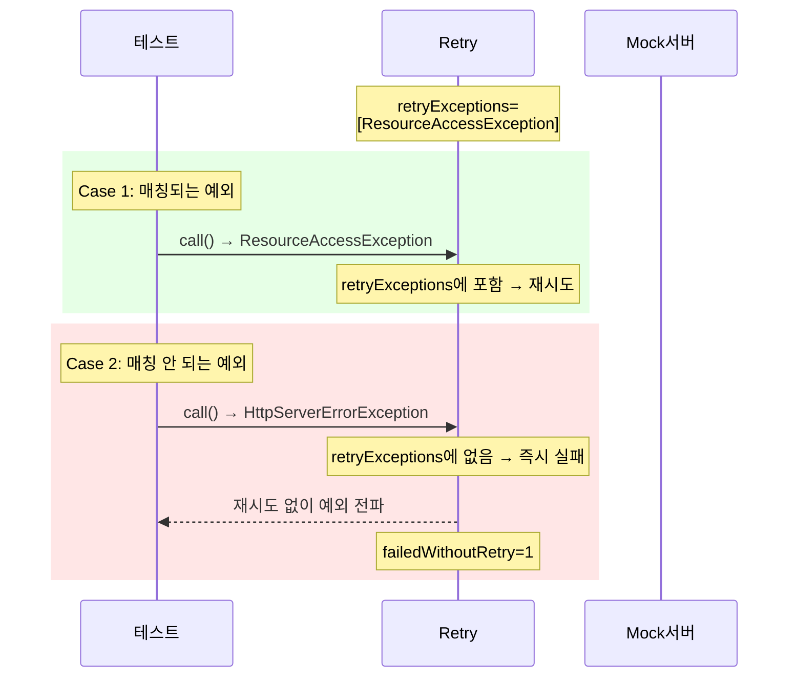
```mermaid
sequenceDiagram
    participant Test as 테스트
    participant Retry as Retry
    participant Mock as Mock서버

    Note over Retry: retryExceptions=<br/>[ResourceAccessException]

    rect rgb(230, 255, 230)
        Note over Test: Case 1: 매칭되는 예외
        Test->>Retry: call() → ResourceAccessException
        Note over Retry: retryExceptions에 포함 → 재시도
    end

    rect rgb(255, 230, 230)
        Note over Test: Case 2: 매칭 안 되는 예외
        Test->>Retry: call() → HttpServerErrorException
        Note over Retry: retryExceptions에 없음 → 즉시 실패
        Retry-->>Test: 재시도 없이 예외 전파
        Note over Retry: failedWithoutRetry=1
    end
```

### 비즈니스 에러(403)는 재시도 안 함

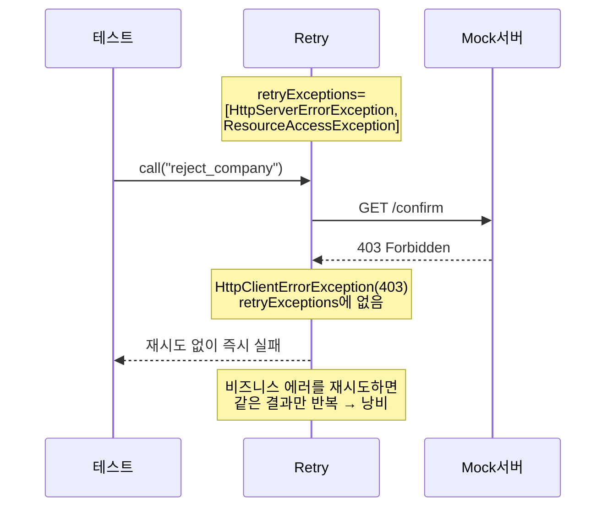
```mermaid
sequenceDiagram
    participant Test as 테스트
    participant Retry as Retry
    participant Mock as Mock서버

    Note over Retry: retryExceptions=<br/>[HttpServerErrorException,<br/>ResourceAccessException]

    Test->>Retry: call("reject_company")
    Retry->>Mock: GET /confirm
    Mock-->>Retry: 403 Forbidden
    Note over Retry: HttpClientErrorException(403)<br/>retryExceptions에 없음
    Retry-->>Test: 재시도 없이 즉시 실패
    Note over Retry: 비즈니스 에러를 재시도하면<br/>같은 결과만 반복 → 낭비
```

---

## RetryWithCircuitBreakerTest

Retry와 CircuitBreaker를 조합할 때 데코레이터 순서가 핵심.

### 잘못된 순서: Retry(바깥) → CB(안쪽)

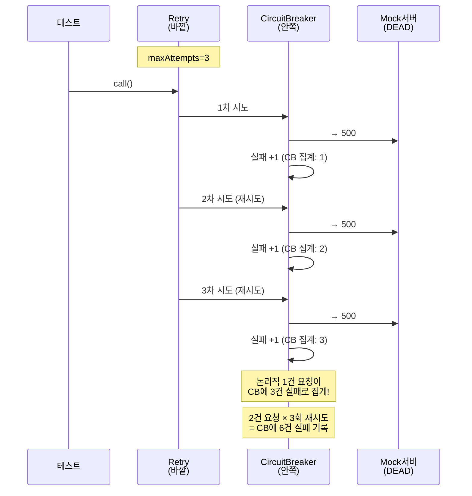
```mermaid
sequenceDiagram
    participant Test as 테스트
    participant Retry as Retry<br/>(바깥)
    participant CB as CircuitBreaker<br/>(안쪽)
    participant Mock as Mock서버<br/>(DEAD)

    Note over Retry: maxAttempts=3

    Test->>Retry: call()
    Retry->>CB: 1차 시도
    CB->>Mock: → 500
    CB->>CB: 실패 +1 (CB 집계: 1)

    Retry->>CB: 2차 시도 (재시도)
    CB->>Mock: → 500
    CB->>CB: 실패 +1 (CB 집계: 2)

    Retry->>CB: 3차 시도 (재시도)
    CB->>Mock: → 500
    CB->>CB: 실패 +1 (CB 집계: 3)

    Note over CB: 논리적 1건 요청이<br/>CB에 3건 실패로 집계!
    Note over CB: 2건 요청 × 3회 재시도<br/>= CB에 6건 실패 기록
```

### 올바른 순서: CB(바깥) → Retry(안쪽)

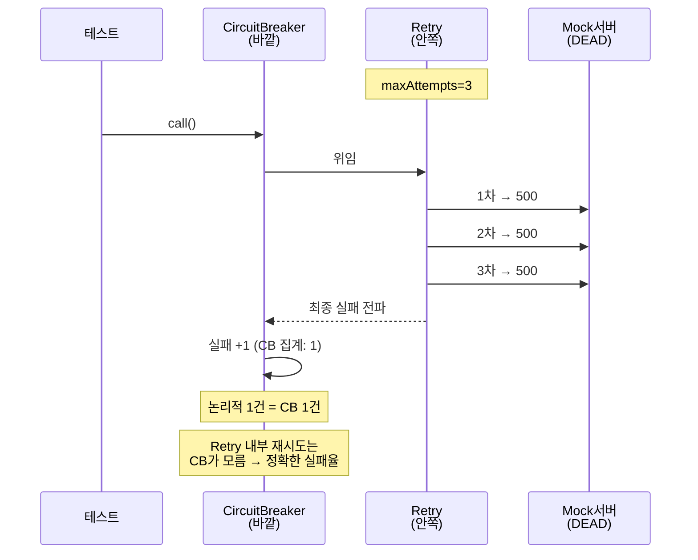
```mermaid
sequenceDiagram
    participant Test as 테스트
    participant CB as CircuitBreaker<br/>(바깥)
    participant Retry as Retry<br/>(안쪽)
    participant Mock as Mock서버<br/>(DEAD)

    Note over Retry: maxAttempts=3

    Test->>CB: call()
    CB->>Retry: 위임
    Retry->>Mock: 1차 → 500
    Retry->>Mock: 2차 → 500
    Retry->>Mock: 3차 → 500
    Retry-->>CB: 최종 실패 전파

    CB->>CB: 실패 +1 (CB 집계: 1)

    Note over CB: 논리적 1건 = CB 1건
    Note over CB: Retry 내부 재시도는<br/>CB가 모름 → 정확한 실패율
```

### 올바른 순서에서 최종 성공 → CB에 성공 1건

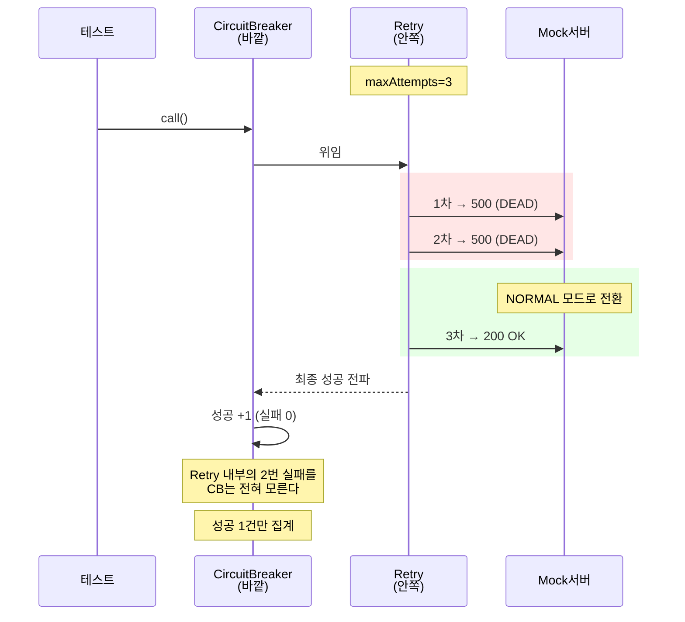
```mermaid
sequenceDiagram
    participant Test as 테스트
    participant CB as CircuitBreaker<br/>(바깥)
    participant Retry as Retry<br/>(안쪽)
    participant Mock as Mock서버

    Note over Retry: maxAttempts=3

    Test->>CB: call()
    CB->>Retry: 위임

    rect rgb(255, 230, 230)
        Retry->>Mock: 1차 → 500 (DEAD)
        Retry->>Mock: 2차 → 500 (DEAD)
    end

    rect rgb(230, 255, 230)
        Note over Mock: NORMAL 모드로 전환
        Retry->>Mock: 3차 → 200 OK
    end

    Retry-->>CB: 최종 성공 전파

    CB->>CB: 성공 +1 (실패 0)

    Note over CB: Retry 내부의 2번 실패를<br/>CB는 전혀 모른다
    Note over CB: 성공 1건만 집계
```

### 핵심 원칙

```
CB(바깥) → Retry(안쪽) → 서버
          ↑ 재시도는 CB 안에서 완결
          ↑ CB는 최종 결과만 집계
```

---

## RetryBackoffTest

고정 대기(waitDuration)와 지수 대기(exponentialBackoff)의 차이, 그리고 jitter의 역할.

### exponentialBackoff: 1초 → 2초 → 4초

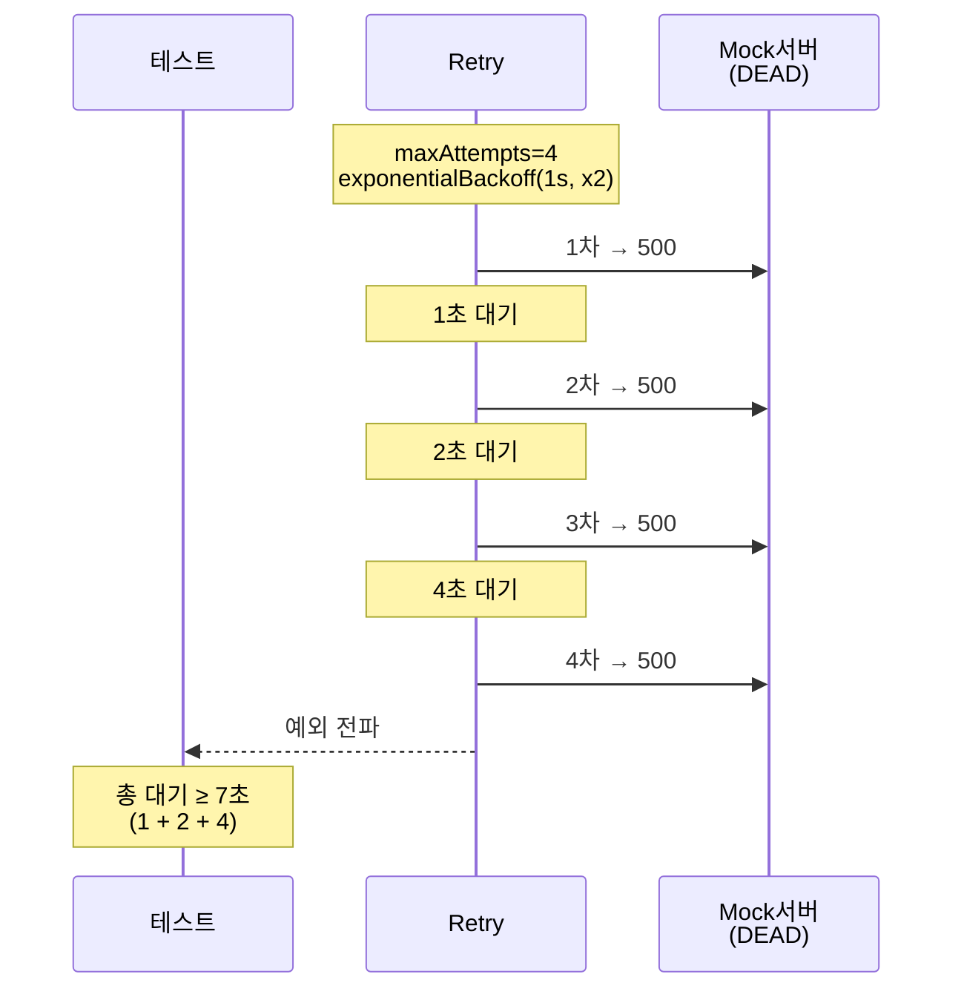
```mermaid
sequenceDiagram
    participant Test as 테스트
    participant Retry as Retry
    participant Mock as Mock서버<br/>(DEAD)

    Note over Retry: maxAttempts=4<br/>exponentialBackoff(1s, x2)

    Retry->>Mock: 1차 → 500
    Note over Retry: 1초 대기
    Retry->>Mock: 2차 → 500
    Note over Retry: 2초 대기
    Retry->>Mock: 3차 → 500
    Note over Retry: 4초 대기
    Retry->>Mock: 4차 → 500

    Retry-->>Test: 예외 전파
    Note over Test: 총 대기 ≥ 7초<br/>(1 + 2 + 4)
```

### exponentialRandomBackoff: jitter로 분산

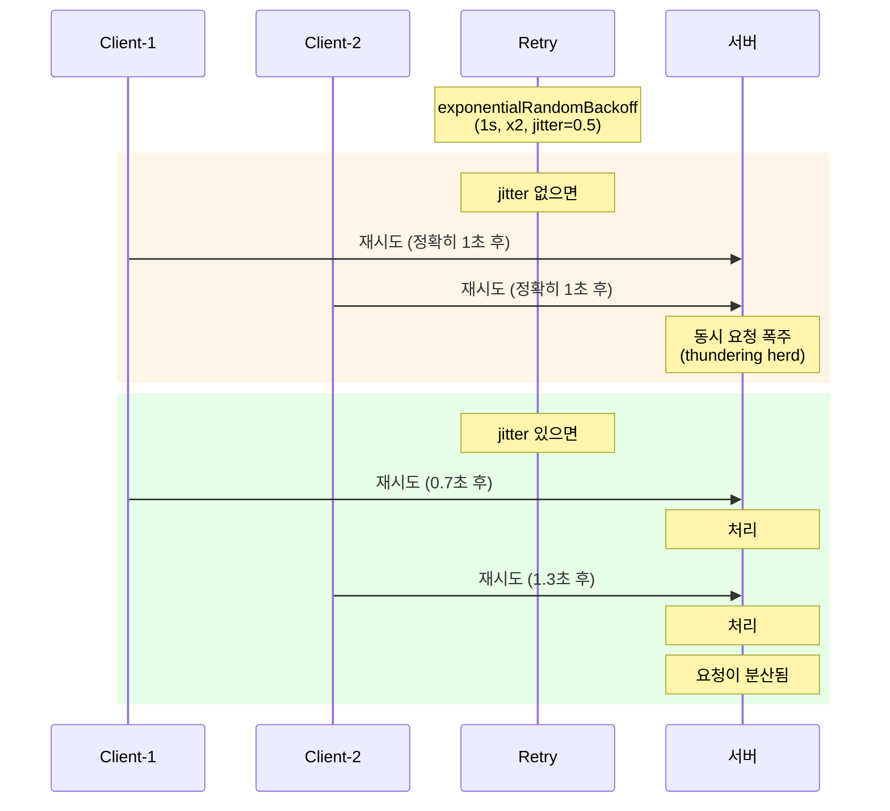
```mermaid
sequenceDiagram
    participant C1 as Client-1
    participant C2 as Client-2
    participant Retry as Retry
    participant Server as 서버

    Note over Retry: exponentialRandomBackoff<br/>(1s, x2, jitter=0.5)

    rect rgb(255, 245, 230)
        Note over Retry: jitter 없으면
        C1->>Server: 재시도 (정확히 1초 후)
        C2->>Server: 재시도 (정확히 1초 후)
        Note over Server: 동시 요청 폭주<br/>(thundering herd)
    end

    rect rgb(230, 255, 230)
        Note over Retry: jitter 있으면
        C1->>Server: 재시도 (0.7초 후)
        Note over Server: 처리
        C2->>Server: 재시도 (1.3초 후)
        Note over Server: 처리
        Note over Server: 요청이 분산됨
    end
```

---

## maxAttempts 의미

### maxAttempts = 초기 호출 포함 총 시도 횟수

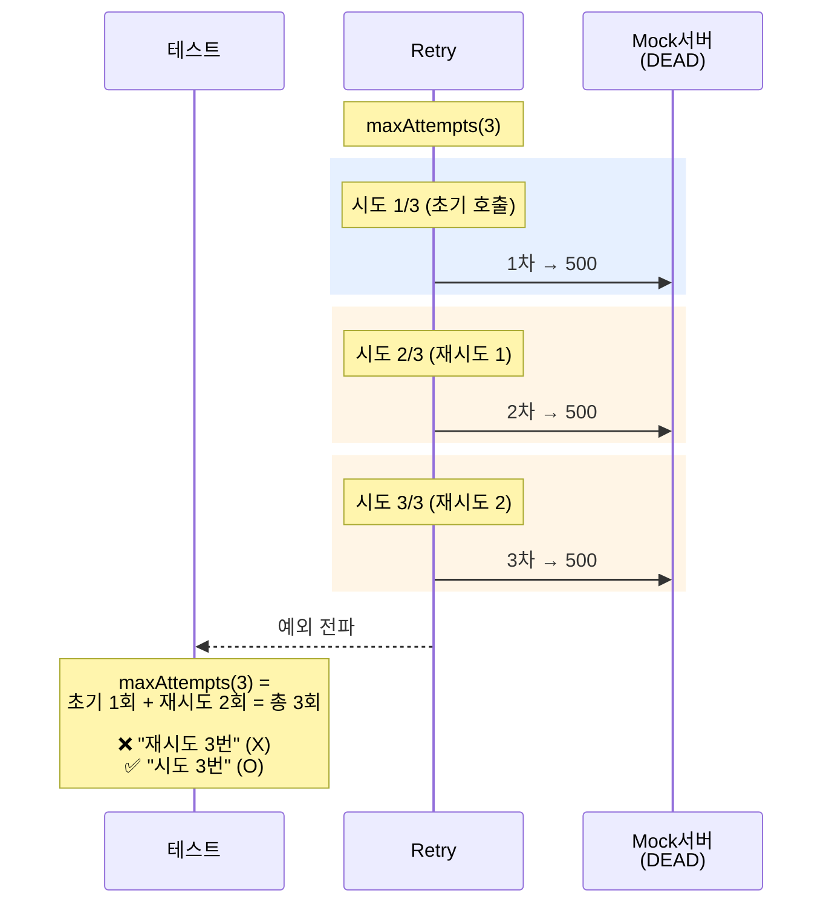
```mermaid
sequenceDiagram
    participant Test as 테스트
    participant Retry as Retry
    participant Mock as Mock서버<br/>(DEAD)

    Note over Retry: maxAttempts(3)

    rect rgb(230, 240, 255)
        Note over Retry: 시도 1/3 (초기 호출)
        Retry->>Mock: 1차 → 500
    end

    rect rgb(255, 245, 230)
        Note over Retry: 시도 2/3 (재시도 1)
        Retry->>Mock: 2차 → 500
    end

    rect rgb(255, 245, 230)
        Note over Retry: 시도 3/3 (재시도 2)
        Retry->>Mock: 3차 → 500
    end

    Retry-->>Test: 예외 전파

    Note over Test: maxAttempts(3) =<br/>초기 1회 + 재시도 2회 = 총 3회<br/><br/>❌ "재시도 3번" (X)<br/>✅ "시도 3번" (O)
```

### failAfterMaxAttempts: 예외 기반 vs 결과 기반

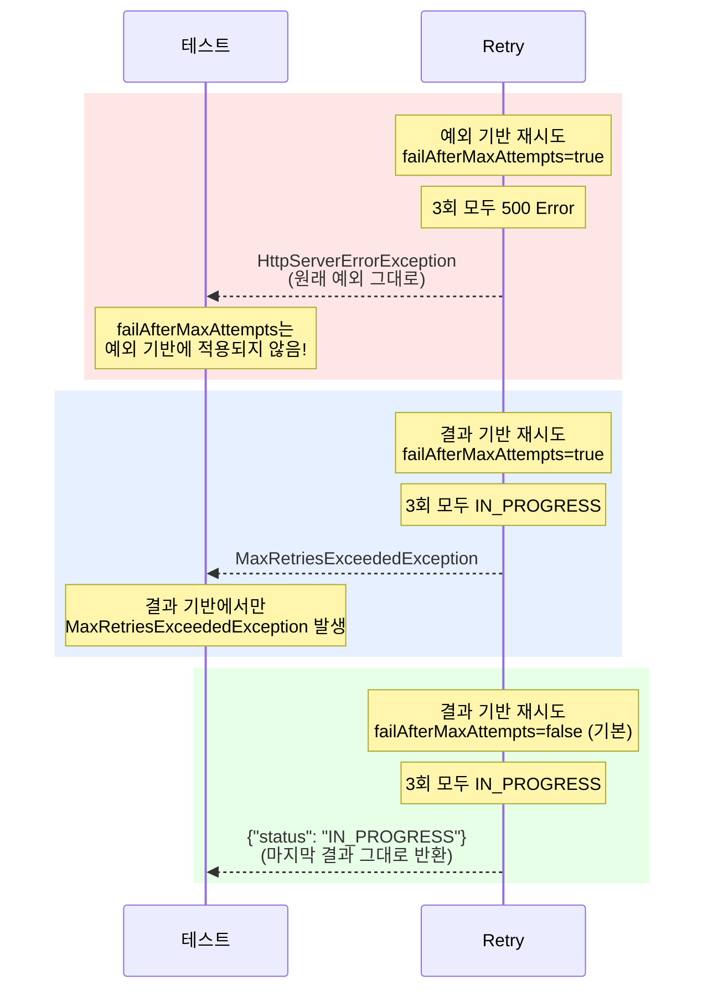
```mermaid
sequenceDiagram
    participant Test as 테스트
    participant Retry as Retry

    rect rgb(255, 230, 230)
        Note over Retry: 예외 기반 재시도<br/>failAfterMaxAttempts=true

        Note over Retry: 3회 모두 500 Error
        Retry-->>Test: HttpServerErrorException<br/>(원래 예외 그대로)

        Note over Test: failAfterMaxAttempts는<br/>예외 기반에 적용되지 않음!
    end

    rect rgb(230, 240, 255)
        Note over Retry: 결과 기반 재시도<br/>failAfterMaxAttempts=true

        Note over Retry: 3회 모두 IN_PROGRESS
        Retry-->>Test: MaxRetriesExceededException

        Note over Test: 결과 기반에서만<br/>MaxRetriesExceededException 발생
    end

    rect rgb(230, 255, 230)
        Note over Retry: 결과 기반 재시도<br/>failAfterMaxAttempts=false (기본)

        Note over Retry: 3회 모두 IN_PROGRESS
        Retry-->>Test: {"status": "IN_PROGRESS"}<br/>(마지막 결과 그대로 반환)
    end
```

---

## RetryResultPredicateTest

예외가 아닌 응답 값을 기준으로 재시도하는 `retryOnResult`.
PG API가 HTTP 200 + `status: "IN_PROGRESS"`를 반환하는 경우.

### 결과값 기반 재시도 → 성공

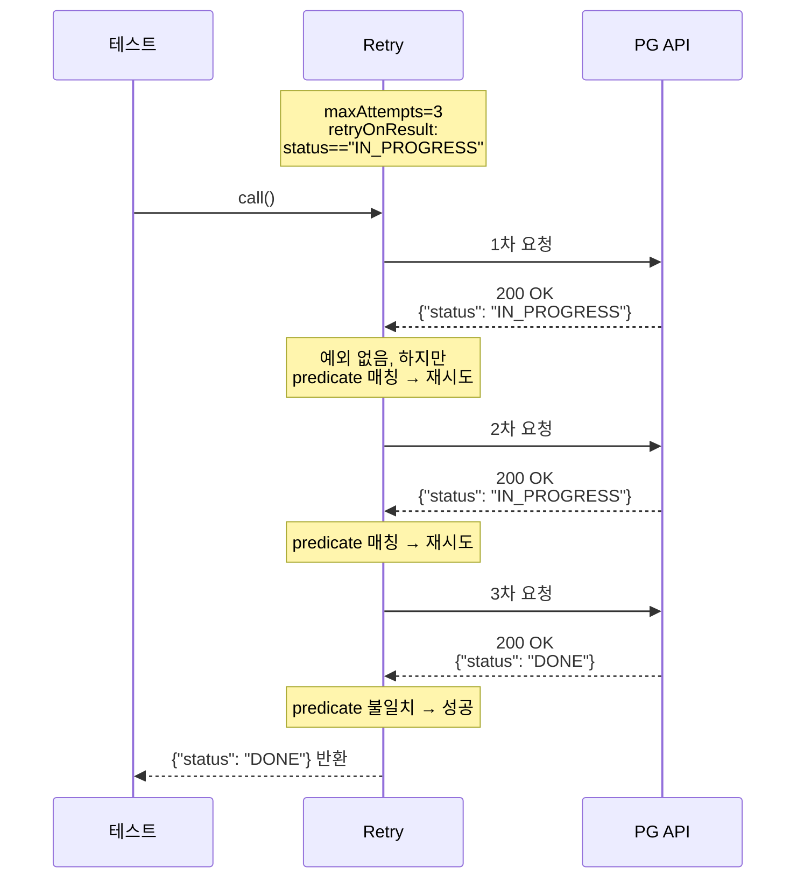
```mermaid
sequenceDiagram
    participant Test as 테스트
    participant Retry as Retry
    participant PG as PG API

    Note over Retry: maxAttempts=3<br/>retryOnResult:<br/>status=="IN_PROGRESS"

    Test->>Retry: call()
    Retry->>PG: 1차 요청
    PG-->>Retry: 200 OK<br/>{"status": "IN_PROGRESS"}
    Note over Retry: 예외 없음, 하지만<br/>predicate 매칭 → 재시도

    Retry->>PG: 2차 요청
    PG-->>Retry: 200 OK<br/>{"status": "IN_PROGRESS"}
    Note over Retry: predicate 매칭 → 재시도

    Retry->>PG: 3차 요청
    PG-->>Retry: 200 OK<br/>{"status": "DONE"}
    Note over Retry: predicate 불일치 → 성공

    Retry-->>Test: {"status": "DONE"} 반환
```

### 모든 시도 매칭 → 마지막 결과 반환 (예외 아님)

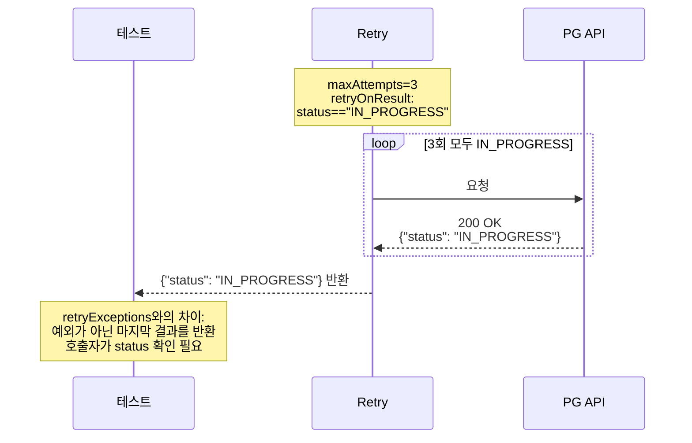
```mermaid
sequenceDiagram
    participant Test as 테스트
    participant Retry as Retry
    participant PG as PG API

    Note over Retry: maxAttempts=3<br/>retryOnResult:<br/>status=="IN_PROGRESS"

    loop 3회 모두 IN_PROGRESS
        Retry->>PG: 요청
        PG-->>Retry: 200 OK<br/>{"status": "IN_PROGRESS"}
    end

    Retry-->>Test: {"status": "IN_PROGRESS"} 반환

    Note over Test: retryExceptions와의 차이:<br/>예외가 아닌 마지막 결과를 반환<br/>호출자가 status 확인 필요
```

### 예외 + 결과값 복합 재시도

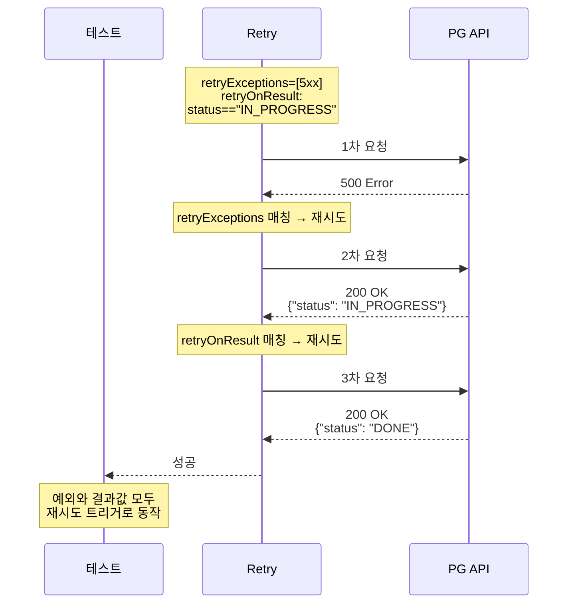
```mermaid
sequenceDiagram
    participant Test as 테스트
    participant Retry as Retry
    participant PG as PG API

    Note over Retry: retryExceptions=[5xx]<br/>retryOnResult:<br/>status=="IN_PROGRESS"

    Retry->>PG: 1차 요청
    PG-->>Retry: 500 Error
    Note over Retry: retryExceptions 매칭 → 재시도

    Retry->>PG: 2차 요청
    PG-->>Retry: 200 OK<br/>{"status": "IN_PROGRESS"}
    Note over Retry: retryOnResult 매칭 → 재시도

    Retry->>PG: 3차 요청
    PG-->>Retry: 200 OK<br/>{"status": "DONE"}

    Retry-->>Test: 성공
    Note over Test: 예외와 결과값 모두<br/>재시도 트리거로 동작
```
