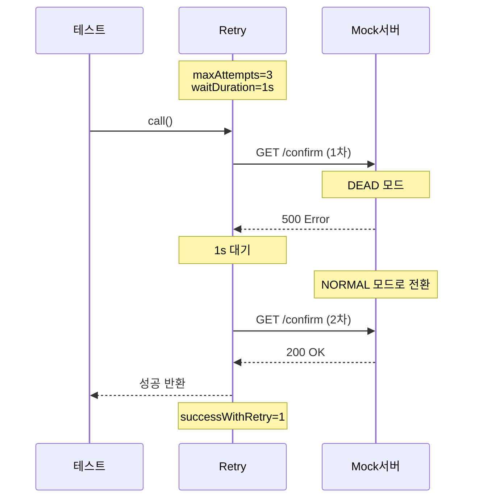
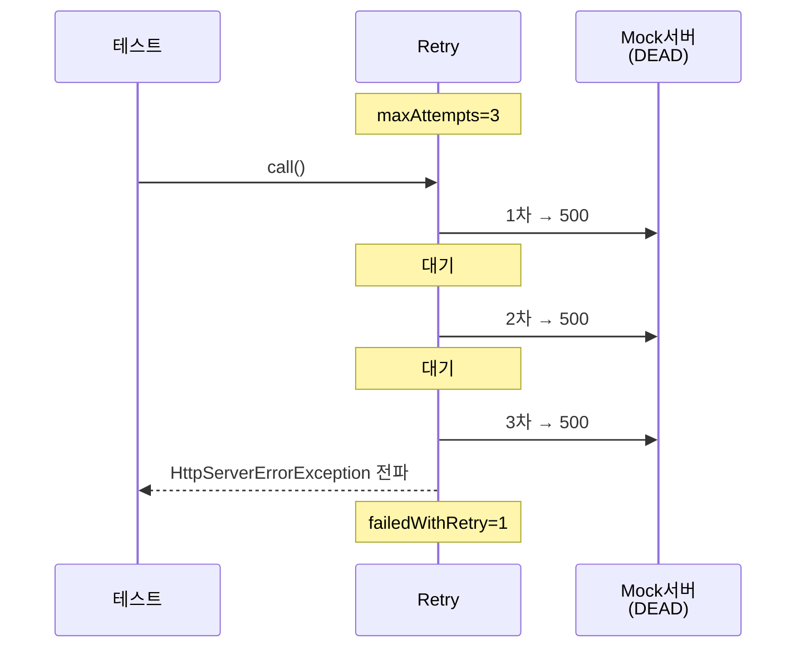
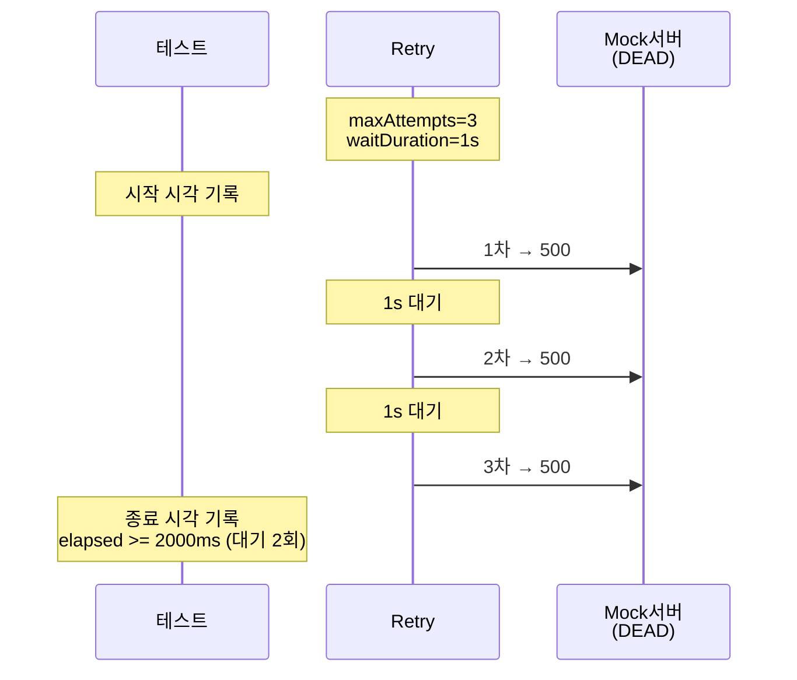
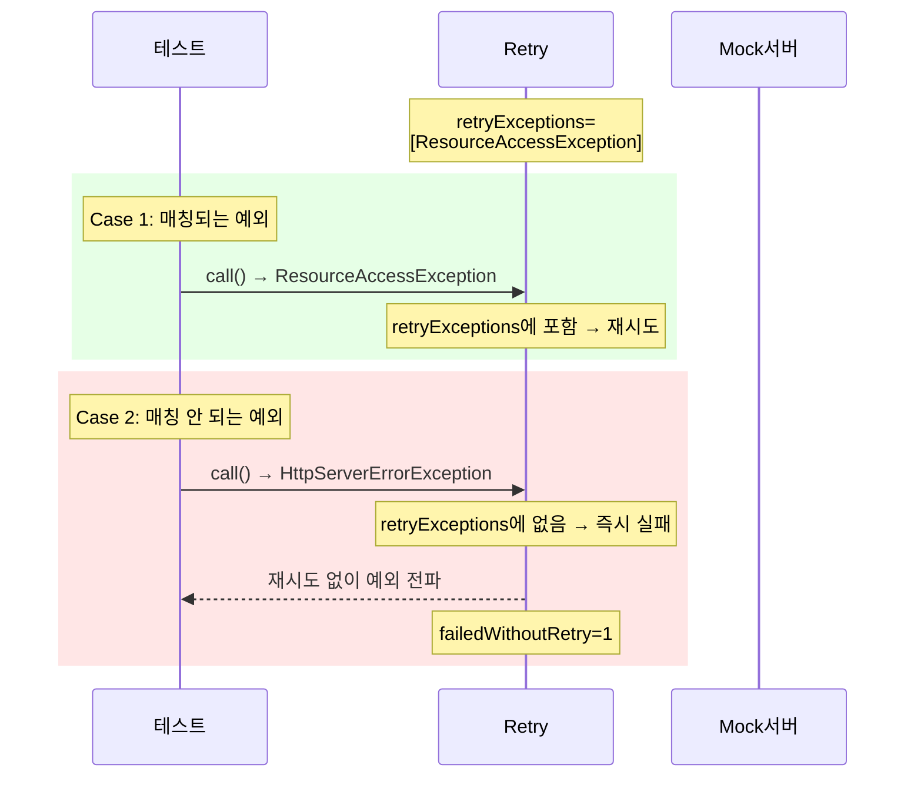
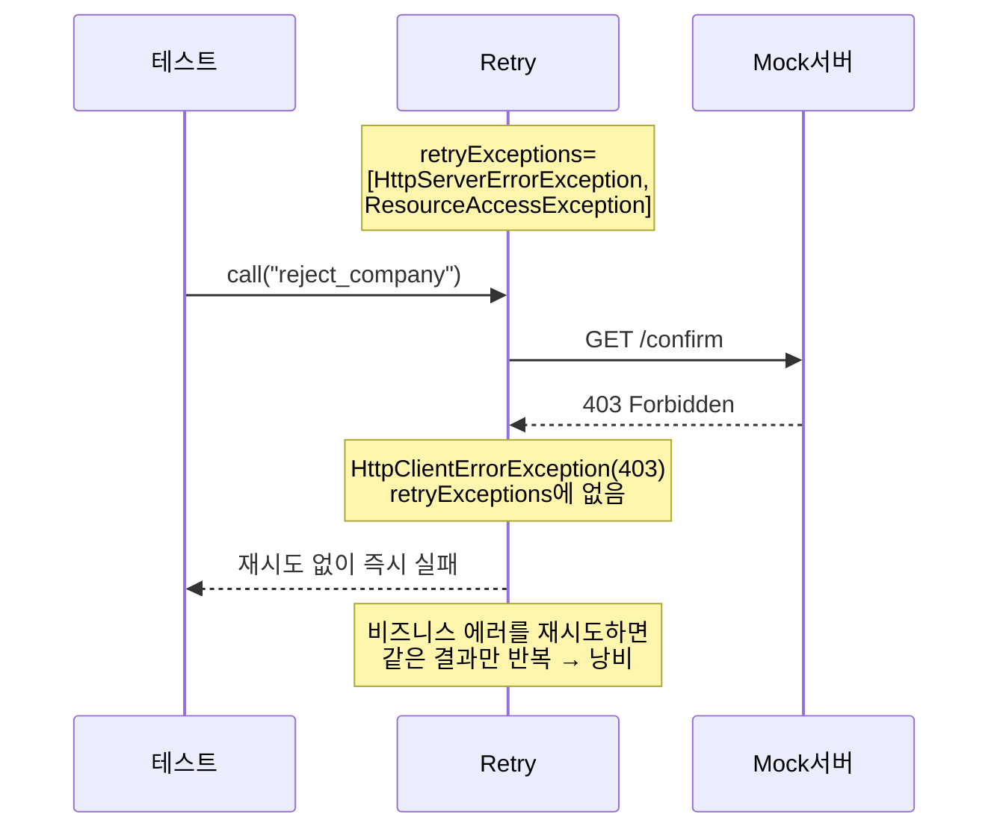
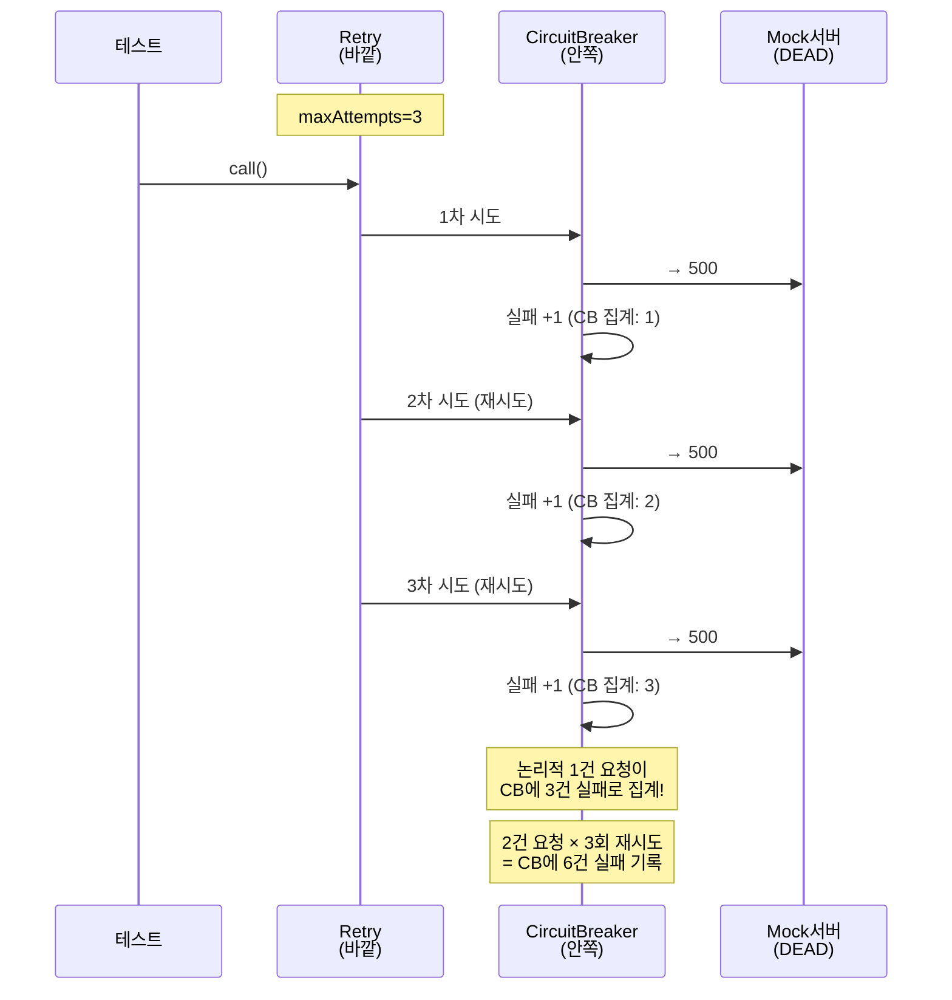
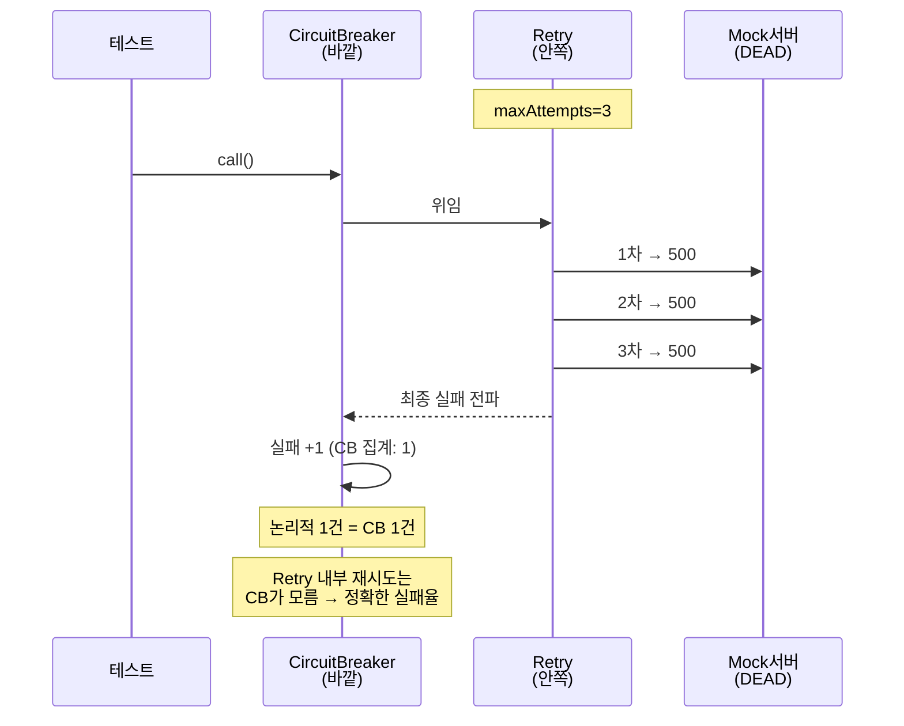

# Retry 학습 테스트

Resilience4j Retry의 핵심 동작, 예외 필터, 그리고 CircuitBreaker 조합 시 AOP 순서 함정.

---

## RetryBasicTest

### 첫 시도 실패 → 재시도 성공



### 전부 실패 → 최종 예외 전파



### waitDuration 대기 시간 검증



---

## RetryExceptionFilterTest

### retryExceptions 화이트리스트



### 비즈니스 에러(403)는 재시도 안 함



---

## RetryWithCircuitBreakerTest

Retry와 CircuitBreaker를 조합할 때 데코레이터 순서가 핵심.

### 잘못된 순서: Retry(바깥) → CB(안쪽)



### 올바른 순서: CB(바깥) → Retry(안쪽)



### 핵심 원칙

```
CB(바깥) → Retry(안쪽) → 서버
          ↑ 재시도는 CB 안에서 완결
          ↑ CB는 최종 결과만 집계
```
