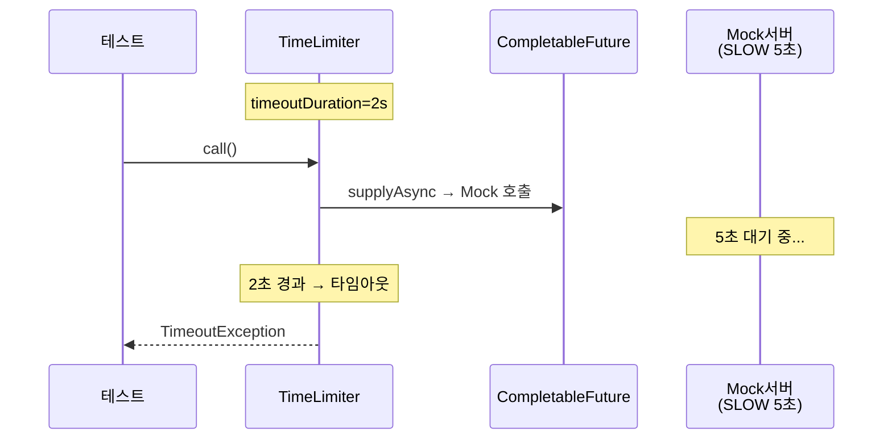
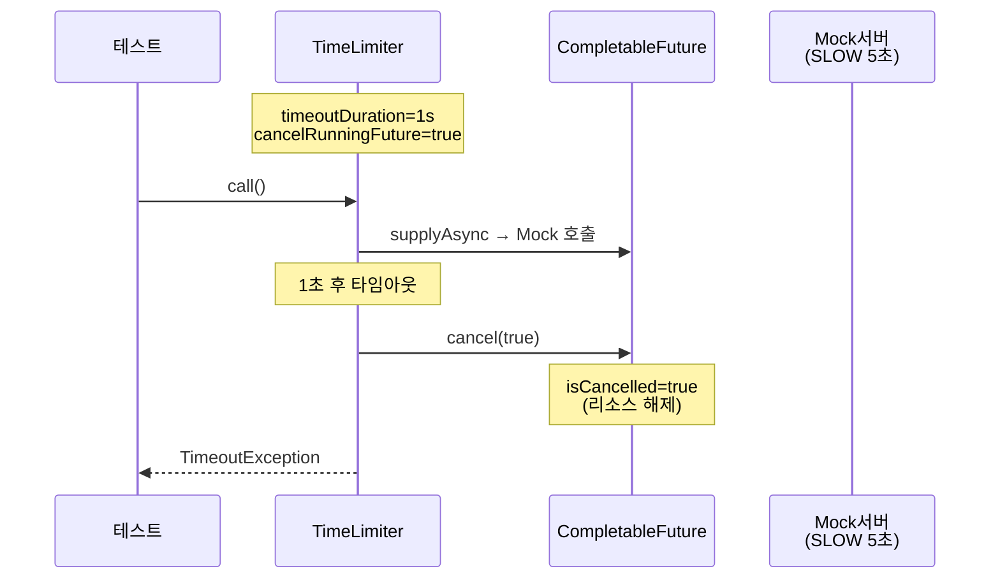
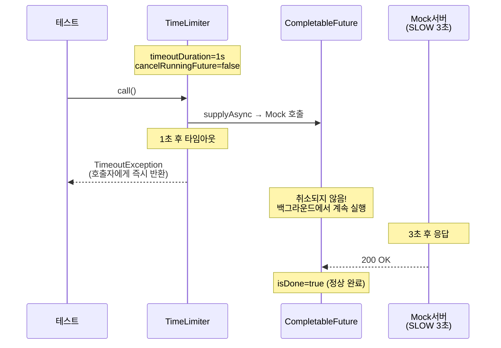
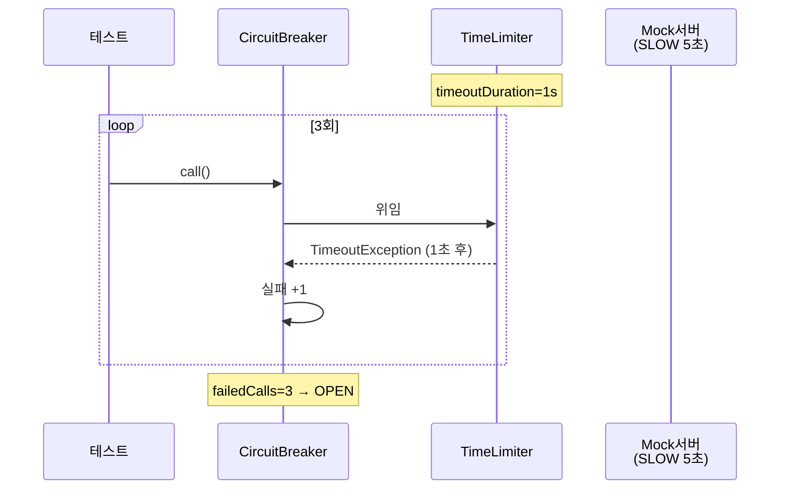
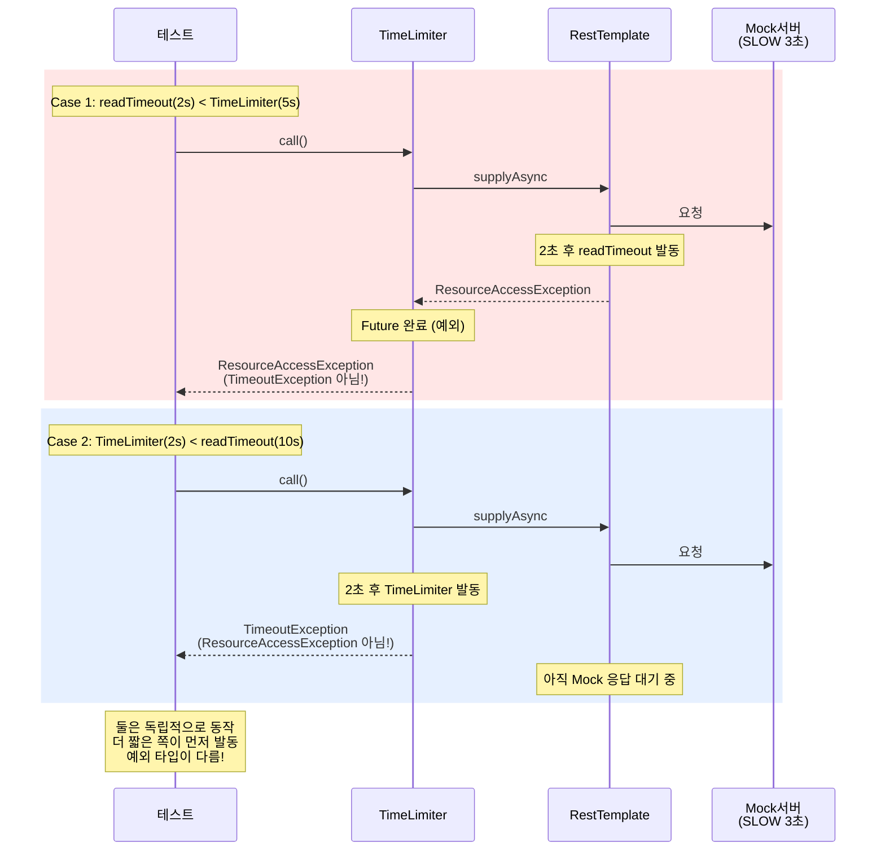

# TimeLimiter 학습 테스트

CompletableFuture 기반 비동기 호출의 타임아웃 제어.
RestTemplate의 readTimeout과는 다른 레이어에서 동작한다.

---

## TimeLimiterBasicTest

### 기본 동작: timeoutDuration 초과 → TimeoutException

### cancelRunningFuture=true → Future 취소

### cancelRunningFuture=false → 작업 계속 실행

### TimeLimiter + CB 조합

### readTimeout vs TimeLimiter

